# 1、需求描述
​	Gartner通过对市场的分析：企业要求降低运维成本，另一方面运营复杂度却越来越高。运营的复杂性可以从体积、种类和速度三个维度上定义：IT基础设施和应用产生的数据量快速增长（每年增长2 ~3倍）；机器和人类产生的数据类型种类越来越多，指标、日志、线路数据和文档等。Gartner预计在未来五年，通过应用大数据和机器学习技术来分析服务的有效性，实现跨域分析可视，从而提高事件和问题参与度的AIOps。
​	从公有云和FusionServer统计的问题分布看，配置错误问题占比50%以上，居高不下。需要维护工具对配置错误快速排障。随着海量应用大量从x86平台向鲲鹏平台迁移，势必会出现各种各样的兼容性问题，性能问题，稳定性问题。对于鲲鹏水平解决方案，如大数据，分布式存储，数据库，HPC等方案，更需要能够可靠的部署在鲲鹏平台上。一旦出现问题，需要尽可能快速的对故障进行定界定位。
​	智能运维工具从如上问题出发，第一期预计实现智能运维基本框架，提供配置溯源，架构感知，故障定位基础能力，支持快速排障和运维成本降低。

## 1.1、受益人
|角色|角色描述|
|:--|:-------|
| 运维人员 | 负责机器运维管理的人员 |
| 普通用户 | 个体用户，注册服务后，依赖于该系统对自己的机器进行监控 |

## 1.3、依赖组件

| 组件          | 组件描述         | 可获得性                                      |
| :------------ | :--------------- | :-------------------------------------------- |
| kafka         | 消息中间件       | 使用openEuler repo源yum install               |
| zookeeper     | kafka集群管理    | 使用openEuler repo源yum install               |
| fluentd       | 日志收集         | ruby gem安装                                  |
| elasticsearch | 分布式数据库     | 官网rpm包安装                                 |
| prometheus    | 数据采集服务     | 使用openEuler repo源yum install               |
| node_exporter | 主机基本信息采集 | 使用openEuler repo源yum install (非21.03版本) |
| ansible       | 配置管理工具     | python pip3安装                               |
| mysql         | 关系型数据库     | 使用openEuler repo源yum install               |

## 1.3、License

Mulan V2

# 2、设计概述
## 2.1、分析思路

## 2.2、设计原则

- 数据与代码分离： 功能实现是需要考虑哪些数据是需要配置动态改变的，不可在代码中将数据写死，应提取出来做成可配置项。

- 分层原则： 上层业务模块的数据查询应通过查询模块调用数据库获取数据，不可直接跨层访问数据库。

- 接口与实现分离：外部依赖模块接口而不是依赖模块实现。

- 模块划分： 模块之间只能单向调用，不能存在循环依赖。

- 变更： 架构设计变更、外部接口变更、特性需求变更需要结合开发、测试等所有相关人员经过开会讨论后决策，不可擅自变更。

# 3、需求分析
## 3.1、USE-CASE视图
### 3.1.1、机器/配置管理


### 3.1.2、异常检测

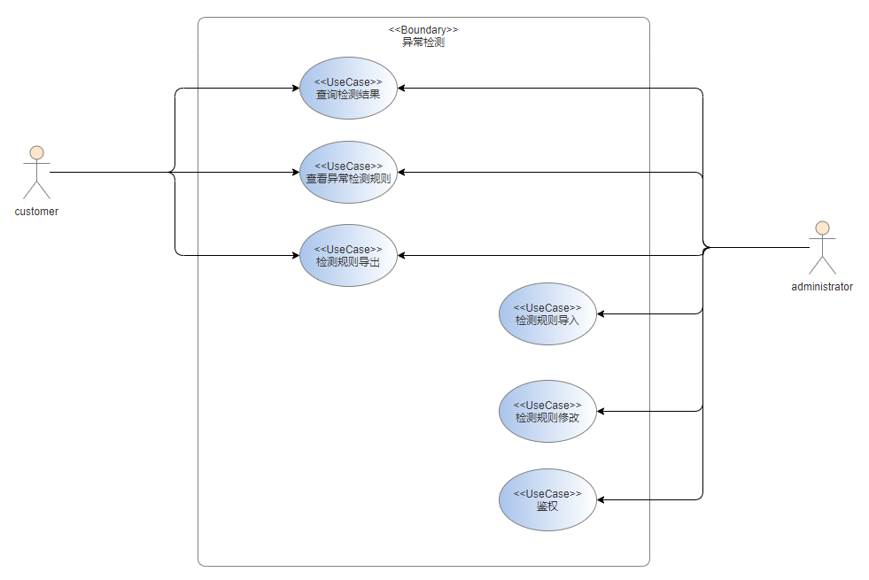

### 3.1.3、故障诊断

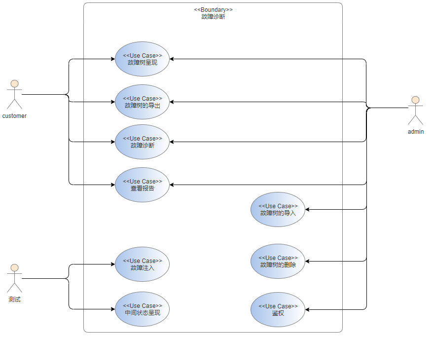


## 3.2、逻辑视图

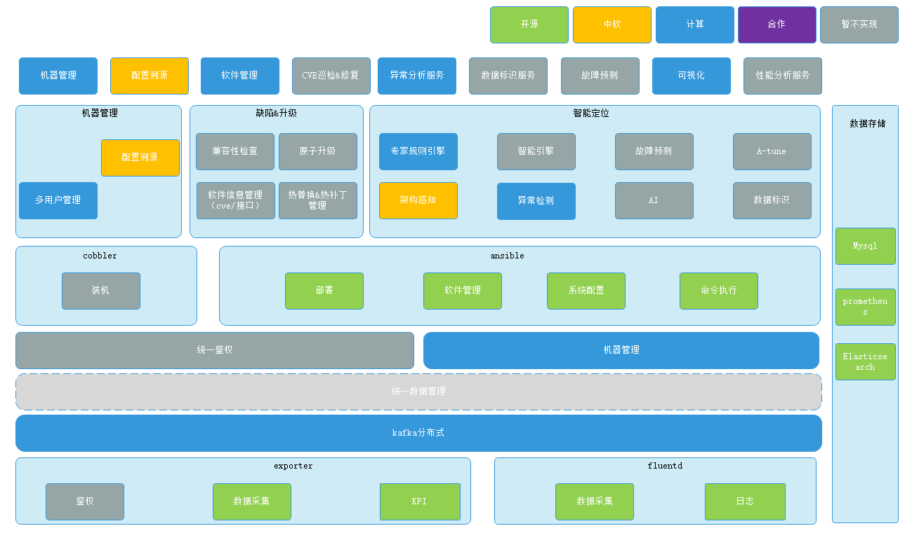

### 3.2.1、机器/配置管理

* 模块介绍

  支持可视化（预留）、一键式部署服务，支持部署到虚拟机或者容器，提供AOPS已知的组件部署模板，支持组件的自由组装编排原子步骤进行部署，实现部署环境标准化和部署过程自动化。
  
* 业务流图

  * 主机管理
  
  

	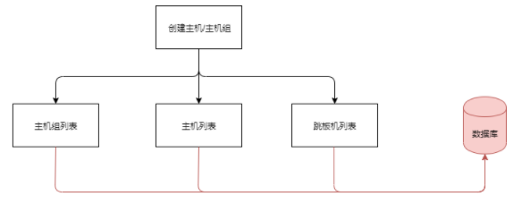

  * 创建任务

	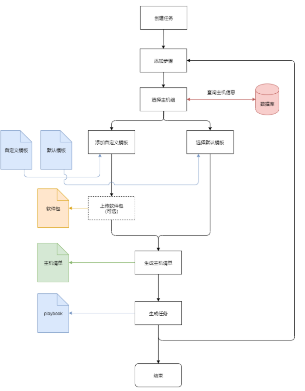
  * 执行任务
  	
  	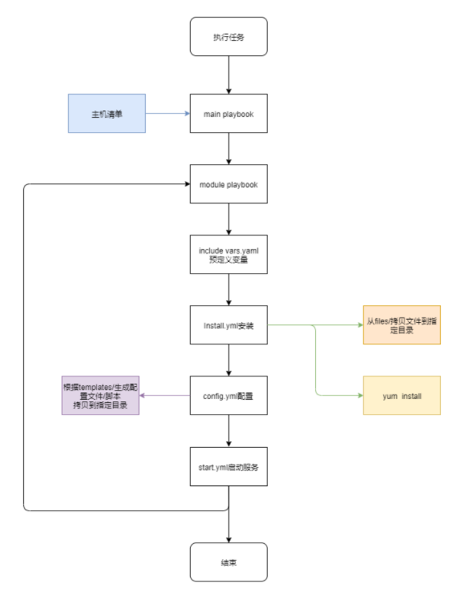

### 3.2.2、数据采集

* 模块介绍

  负责数据的实时采集，最终存储到数据库，供上层应用查询使用

* 业务流图

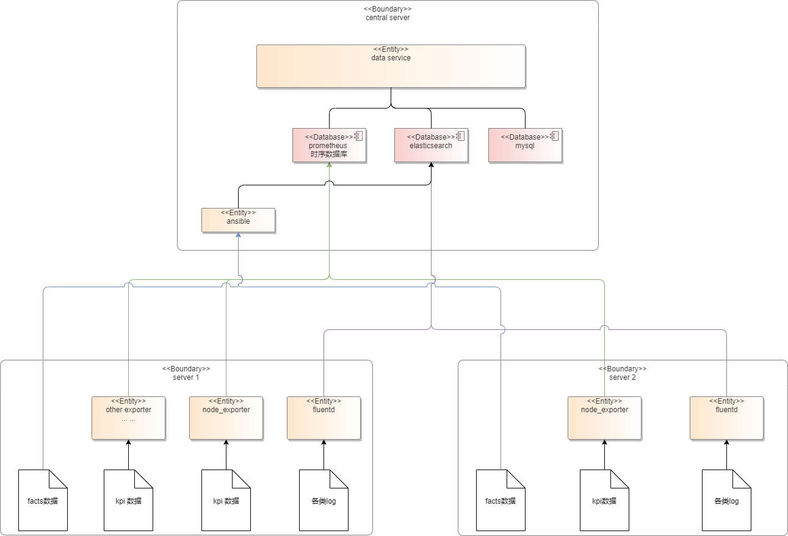

### 3.2.3、异常检测

* 模块介绍

  实现定时拉取原始数据，并进行预处理，随后根据异常检测规则进行异常检测，并生成相应的结果存入数据库。
  
* 业务流图

  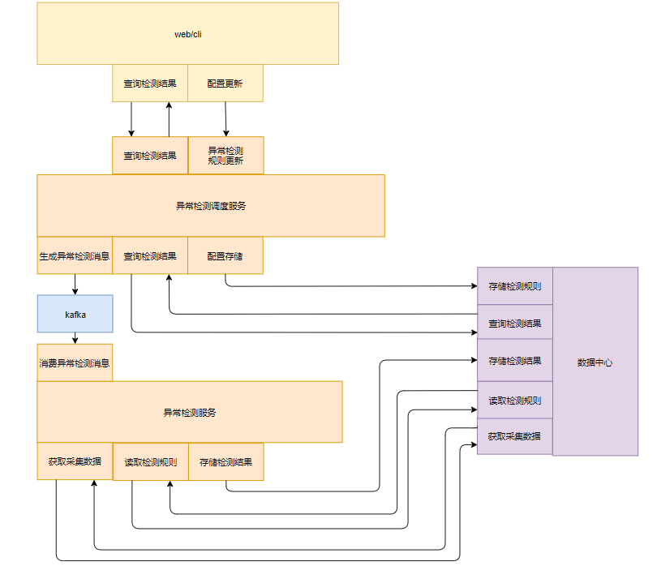

### 3.2.4、故障诊断

* 模块介绍

  诊断服务主要依据于故障诊断树，每颗故障树代表了一类问题的专家规则。诊断时首先获取故障树节点的异常检测结果，随后根据定义的故障树的结构推导出最终的根因，最终返回相应的报告。

* 业务流图

  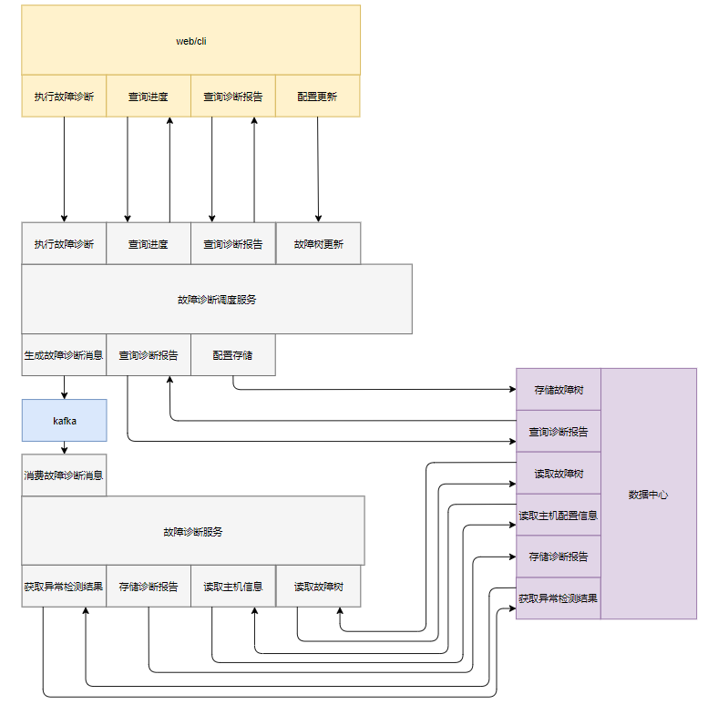
  
## 3.3、时序视图

### 3.3.1、机器/配置管理

* 主机管理

  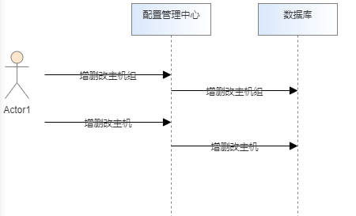

* 创建任务

  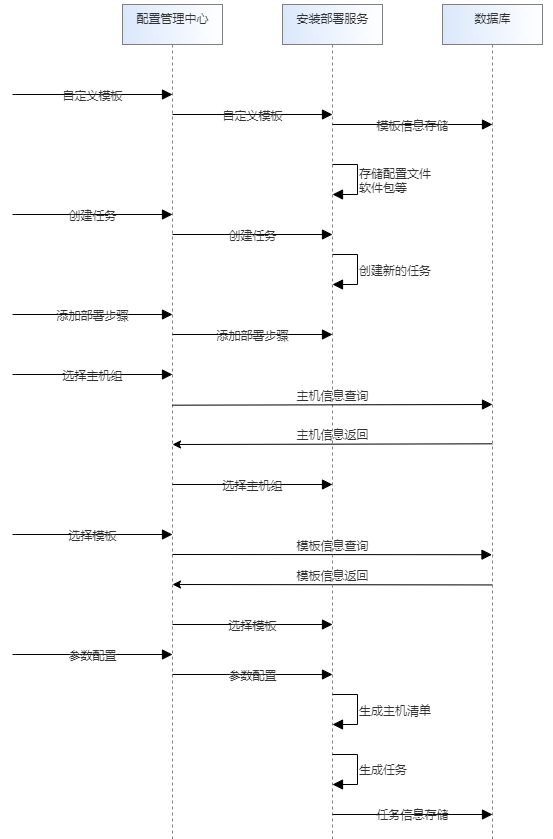

* 执行任务

  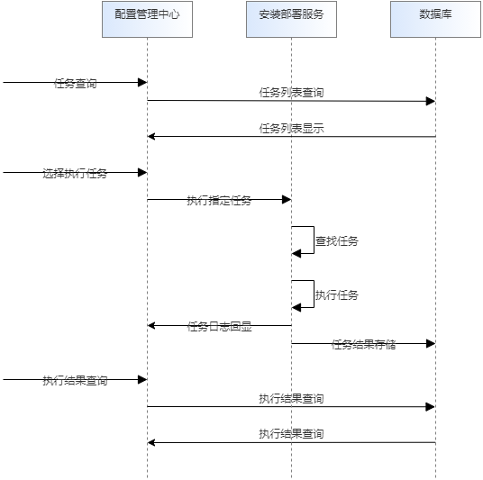

### 3.3.2、异常检测

* 异常检测

  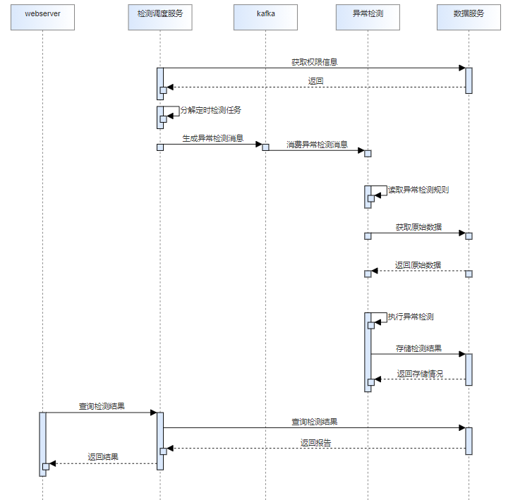

* 检测规则的导入与导出

  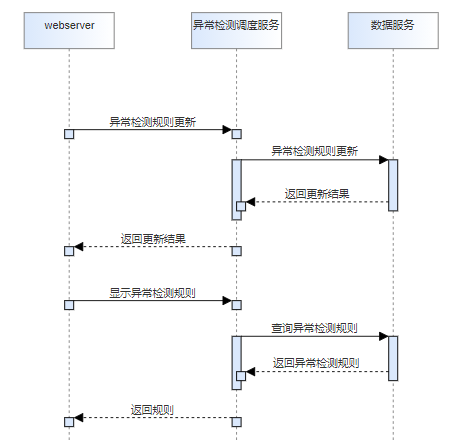


### 3.3.3、故障诊断

* 故障诊断

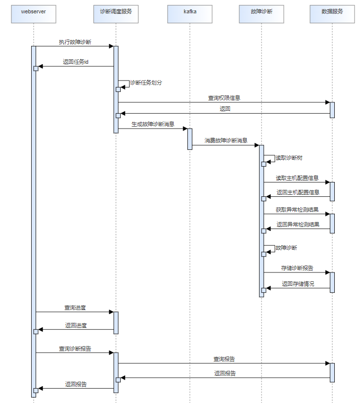

* 故障树的导入与导出

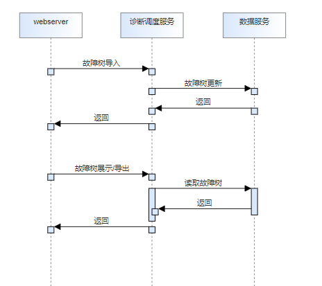

## 3.4、开发视图


## 3.5、部署视图
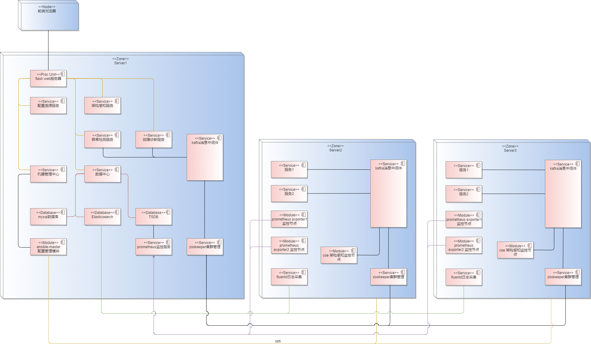

* 预安装部署

  1. 安装包将server端的框架服务安装
     软件包中需要包含webserver、配置管理中心、数据中心、数据库。
  
  2. 根据配置自定义服务的配置与部署
     初始安装时只部署在本地，即中心节点，按照默认配置安装webserver，配置管理中心、数据中心、数据库。
  
* 安装部署

  预安装完成后，保证中心节点的基本框架可用。能够支持用户完成配置管理功能，用户可以在前端进行后续的部署与配置动作。

## 3.6、DFX分析
### 3.6.1、性能规格

|规格名称|规格指标|
|:--|:-------|
|内存占用| 随监控主机数量以及监控项数量增加而增加，平均每台主机（100监控项）占用内存100M |
|启动时间| 5s内启动 |
|响应时间|2-3秒内给出响应。故障诊断响应时间视诊断时间、故障树数量、故障树复杂度、机器数量而定，执行故障诊断后会定时返回进度，平均单颗树、单个机器每小时的诊断时间为2s|
|管理主机规格|支持对1000+台主机的监控，智能定位服务每单个实例可支持10台主机（100监控项）的监控|
### 3.6.2、系统可靠性设计

1. **异常情况**：
   AOPS框架中的各服务目前21.09版本使用daemon来控制与守护，并监控服务的运行状态。后续版本可以以容器启动，容器终止后，可以使用k8s重启，当前版本不实现。
   
2. **数据库**：
   系统增加定时任务，在指定的时间段内，对系统中的数据做备份，默认保留最近1周的数据，便于后期恢复，该周期可配置 。
   
3. **集群部署**

   支持数据库，智能定位服务的集群部署，智能定位服务可通过扩展多实例，并通过消息队列进行负载均衡。

### 3.6.3、安全性设计

1. **数据库权限**
      由于AOPS支持多用户对其私人的主机/主机组进行检测和诊断，需要对不同用户的信息做隔离操作。数据库统一对用户进行了区分，即用户只能访问其相关主机的信息。

2. **用户权限问题**

   将用户分为普通用户、管理员两类。普通用户针对其有权限的主机，拥有查询主机信息、查看检测规则、查看故障树、执行诊断、查看检测和诊断的结果的权限；管理员负责管理集群以及用户，拥有所有普通用户的权限，并负责集群内主机的管理和部署、部署任务管理、检测规则管理、故障树管理以及用户权限的查询和修改。目前系统有默认的admin账户，密码为changeme，用户第一次登录后需要修改密码才能继续使用。主机在第一次添加时需额外输入密钥，作为该主机密码的加密密钥，主机密码加密后保存，后续使用时用户需通过认证接口输入该密钥，方能执行相应操作。

3. **文件权限问题**

   采用权限最小化策略，代码开发完成后补充相关文件的权限设计

4. **restful接口安全**

   发送请求时使用token进行身份验证，使用https服务确保请求参数被加密，后端接收请求后对接口参数做每个参数类型的校验。

5. **命令注入问题**

   命令行操作，入参会做校验，而且后台为解析参数后调用url接口，不存在入参拼接命令执行操作，所以不存在命令注入问题。
   
6. **威胁分析**
  
   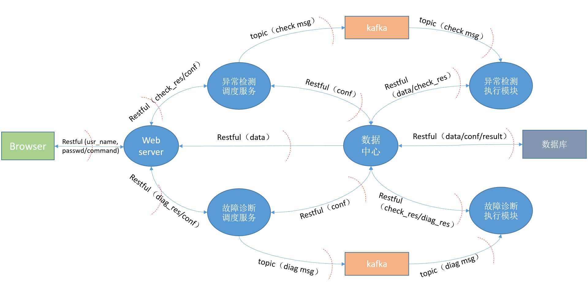
   
   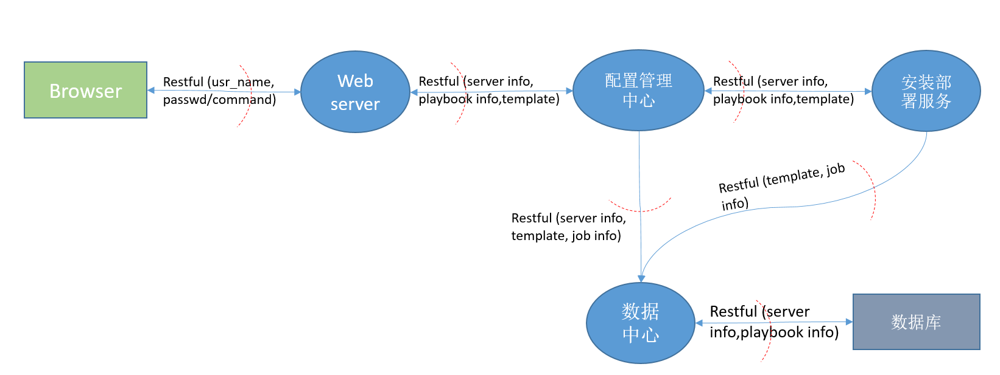

### 3.6.4、兼容性设计

1. 多实例任务之间消息通信采用kafka消息队列框架，生产者与消费者解耦。
2. 服务对外接口使用restful接口，对外接口只能增量变化，新版本保证旧版本接口可用。
3. 对于底层缓存，数据库的变更，对外不体现，由代码逻辑保证可用性。

### 3.6.5、可服务性设计

待考虑

### 3.6.6、可测试性设计

待考虑

## 3.7、特性清单

### 3.7.1、基础服务

|no|SR|AR|描述|代码估计规模(k)|实现版本|
|:--|:----|:------|:---------|---|---|
| 1 | Aops状态检查 | 启动环境检查 | 检查OS版本等各种信息，包括用户权限检查 |||
| 2 |  | 启动服务检查 | 检查依赖的服务状态是否处于正常工作状态 |||
| 3 | 服务配置检查 | 配置管理中心配置文件校验 | 校验服务url、数据中心url |||
| 4 | | 数据中心配置文件校验 | 校验服务url，校验mysql、es、prometheus的url |||
| 5 | | 异常检测调度服务配置文件校验 | 校验服务url，校验kafka的url，数据中心的url |||
| 6 | | 异常检测执行模块配置文件校验 | 校验kafka的url，数据中心的url |||
| 7 | | 故障诊断调度服务配置文件校验 | 校验服务url，校验kafka的url，数据中心的url |||
| 8 |  | 故障诊断执行模块配置文件校验 | 校验kafka的url，数据中心的url |||
| 9 | 软件包 | 软件包elasticsearch引入 | es作为Aops存储配置、报告以及日志的数据库，在openEuler版本中没有，需要引入 |0.4|21.09|
| 10 |  | 软件包fluentd引入 | fluentd作为Aops采集日志的工具，需要在openEuler版本中引入 |0.2|21.09|
| 11 |  | 软件包ansible升级 | ansible作为Aops部署的工具，在当前openEuler中版本过低，在python3.7+下使用出错，需要升级到较新版本 |0.2|21.09|
| 12 |  | Aops的spec编写 | 构建Aops基础服务rpm包所需的spec编写，子包包括配置管理中心及数据中心 |0.2|21.09|
| 13 |  | 智能定位的spec编写 | 构建智能定位rpm包所需的spec编写，子包包括异常检测、异常检测调度服务、故障诊断、故障诊断调度服务 |0.2|21.09|
| 14 | 基础服务部署 | 实现webserver的部署启动脚本 | 实现webserver的部署启动脚本 |0.1|21.09|
| 15 |  | 实现配置管理服务的部署启动脚本 | 实现配置管理中心的部署启动脚本 |0.1|21.09|
| 16 |  | 实现数据中心服务的部署启动脚本 | 实现数据中心的部署启动脚本 |0.1|21.09|
| 17 |  | 实现elasticsearch的部署启动脚本 | 实现elasticsearch的部署启动脚本 |0.1|21.09|
| 18 |  | 实现mysql的部署启动脚本 | 实现mysql的部署启动脚本 |0.1|21.09|
| 19 | 支持不同消息队列 | 支持kafka作为消息队列框架 | 屏蔽底层消息队列，对消息队列的通用接口（连接，生产，消费）进行封装 |0.1|21.09|
| 20 | 支持多方鉴权 | 支持oauth2协议 | 支持通过可选的协议进行第三方鉴权 |||
| 21 | Aops使用手册编写 | 提供服务部署手册 | 提供服务部署的使用说明 |||
| 22 |  | 提供机器管理手册 | 提供主机管理的使用说明 |||
| 23 |  | 提供异常检测说明手册 | 提供异常检测规则的介绍以及检测结果的介绍 |||
| 24 |  | 提供故障诊断说明手册 | 提供故障树的介绍、故障诊断的使用说明、诊断结果的介绍 |||

### 3.7.2、机器/配置管理
|no|SR|AR|描述|代码估计规模|实现版本|
|:--|:----|:------|:---------|---|---|
| 1 | 主机管理 | 添加主机 | 用户可以添加一个或多个主机并进行授信，并对每个主机生成唯一的标识 |0.1|21.09|
| 2 | | 主机组创建 | 可以创建主机组对多个主机统一操作 |0.1|21.09|
| 3 | | 主机和主机组可以修改和删除 | 主机和主机组可以修改和删除 |0.1|21.09|
| 4 | | 支持查询主机和主机组（操作日志管理） | 可以查询主机和主机组的信息 |0.1|21.09|
| 5 | | 记录操作日志 | 记录主机操作相关的操作日志 |0.1|21.09|
| 6 | | 提供主机管理命令行 | 支持通过命令行添加、删除、查询主机和主机组 |0.1|21.09|
| 7 | 组件模板管理 | 支持用户添加自定义模板 | 支持用户添加自定义模板并解析，[模板示例](../manual/deployment_guidance.md) |||
| 8 |  | 支持用户删除自定义模板 | 支持用户删除自定义模板 |||
| 9 |  | 支持用户查看当前自定义模板 | 支持用户查看模板列表信息 |||
| 10 | | 记录操作日志 | 记录模板操作相关的操作日志 |||
| 11 | | 提供组件模板管理命令行 | 支持通过命令行添加、删除、查看模板 |||
| 12 | | 提供kafka部署模板 | 提供kafka的集群部署模板，用户可配置主机信息 |0.2|21.09|
| 13 | | 提供zookeeper部署模板 | 提供zookeeper的集群部署模板，用户可配置主机信息 |0.2|21.09|
| 14 | | 提供fluentd部署模板 | 提供fluentd部署模板，用户可配置主机信息以及采集配置 |0.1|21.09|
| 15 | | 提供node_exporter部署模板 | 提供node_exporter部署模板，用户可配置主机信息 |0.1|21.09|
| 16 | | 提供prometheus部署模板 | 提供prometheus部署模板，用户可配置主机信息，exporer信息 |0.1|21.09|
| 17 | | 提供架构感知部署模板 | 提供架构感知部署模板，用户可配置主机信息及其配置文件 |0.1|21.09|
| 18 | | 提供配置溯源部署模板 | 提供配置溯源部署模板，用户可配置主机信息及其配置文件 |0.1|21.09|
| 19 | | 提供异常检测部署模板 | 提供异常检测部署模板，用户可配置主机信息及其配置文件 |0.1|21.09|
| 20 | | 提供故障诊断部署模板 | 提供故障诊断部署模板，用户可配置主机信息及其配置文件 |0.1|21.09|
| 21 | 部署任务管理 | 支持用户创建部署任务 | 用户可以创建一个或多个部署任务，部署任务可以通过预定义模板或者自由编排步骤创建 |||
| 22 | | 支持用户删除部署任务 | 用户能够删除部署任务 |||
| 23 | | 支持部署任务列表查看 | 能够查看当前系统有哪些部署任务 |0.1|21.09|
| 24 | | 支持部署任务的自动编排 | 支持根据服务间的依赖关系自动编排任务 |||
| 25 | | 支持批量部署 | 用户可以在一个部署任务中选择多个主机和多个主机组，实现多主机批量部署 |0.1|21.09|
| 26 | | 支持任务的并行部署 | 并行执行部署任务 |||
| 27 | | 支持任务的超时停止 | 任务执行超时后停止 |||
| 28 |  | 支持任务的配置参数修改（待定） | 在执行时由用户指定参数值，任务用指定值替换相应参数执行 |||
| 29 |  | 支持动态执行参数（待定） | 在执行时动态输入参数而不用修改部署任务，增强部署任务的重用性和灵活性 |||
| 30 |  | 记录操作日志 | 记录任务部署的操作日志 |0.1|21.09|
| 31 |  | 提供部署任务管理命令行 | 支持通过命令行创建、查看、删除部署任务 |0.1|21.09|
| 32 | 部署详情显示 | 支持部署过程中服务动态消息记录 | 记录包括部署成功、部署失败和部署任务更新和删除消息 |||
| 33 | | 支持当前部署任务查看 | 用户可以查看部署详情，可视化显示部署进程、当前部署任务信息 |||
| 34 | | 支持历史部署任务信息统计 | 支持部署成功率、部署任务个数、部署总次数、部署成功次数和失败次数统计 |||
| 35 | 配置管理 | 主机配置文件内容收集 | 支持收集指定主机的指定配置文件的内容以及文件属性、文件owner |0.4|21.09|
| 36 |  | 配置文件下发 | 支持下发指定配置到指定主机 |||
| 37 |  | 支持下发命令并执行 | 支持下发配置后在主机上执行指定命令 |||
| 38 |  | 记录操作日志 | 记录配置管理的操作日志 |||

### 3.7.3、数据
|no|SR|AR|描述|代码估计规模|实现版本|
|:--|:----|:------|:---------|---|---|
| 1 | 日志数据收集 | message日志的采集配置 | 通过fluentd收集需要配置message日志的路径、解析规则、存储地址（elasticsearch） |0.1|21.09|
| 2 |  | kbox日志的采集配置 | 通过fluentd收集需要配置kbox日志的路径、解析规则、存储地址（elasticsearch） |0.1|21.09|
| 3 |          | history日志的采集配置 | 通过fluentd收集需要配置history日志的路径、解析规则、存储地址（elasticsearch） |0.1|21.09|
| 4 | kpi数据收集 | 支持node_exporter | node_exporter采集节点的基础信息，其采集数据列表见[exporter采集列表](./智能定位数据采集项.md) |0.1|21.09|
| 5 | 主机配置数据收集 | os信息收集 | 收集os版本、内核版本、bios版本 |0.1|21.09|
| 6 | | cpu信息收集            | 收集cpu制造商、型号、核数量、频率、L1/L2/L3缓存              |0.1|21.09|
| 7 | | 内存信息收集 | 收集内存制造商、容量信息、运行频率 |||
| 8 | | 网卡信息收集 | 收集网卡制造商、型号、驱动版本、名称 |||
| 9 | | 磁盘信息收集 | 收集磁盘数量、名称、制造商、型号 ||          |
| 10 | | 主板信息收集 | 收集主板制造商、型号 ||          |
| 11 | 数据处理 | 提供数据对齐功能 | 在异常检测中用到多个数据时，可能由于数据采集周期的偏差导致几个数据时间点无法对应，因此需要对齐 |0.3|21.09|
| 12 | | 提供数据缺失值处理功能 | 对指定时间的数据处理时可能存在数据缺失情况，因此需要缺失值处理 |||
| 13 |  | 数据的定期清理 | 定期清理数据，可配置                     |||
| 14 | | 数据的转储 | 当数据达到一定大小时进行数据转储，可配置     |||
| 15 | 数据库封装 | 支持主机信息的增删查        | 支持集群内主机信息的增加删除和查询                     | 0.1 | 21.09 |
| 16 |                      | 支持主机组信息的增删查      | 支持集群内主机组信息的增加删除和查询                   | 0.1 | 21.09 |
| 17 |                      | 支持主机配置信息的增删查    | 支持集群内主机的配置信息如cpu核数、网卡名字的增加删除和查询 | 0.1 | 21.09 |
| 18 |  | 支持原始采集数据的删查 | 支持原始采集数据的删除和查询 |0.2|21.09|
| 19 |  | 支持ansible模板的增删查 | 支持ansible的playbook信息的增加删除和查询 |0.1|21.09|
| 20 |                      | 支持ansible任务信息的增删查 | 支持ansible任务信息的增加删除和查询                    | 0.1 | 21.09 |
| 21 |                      | 支持检测结果的增删查        | 支持异常检测结果的增加删除和查询                       | 0.1 | 21.09 |
| 22 |                      | 支持检测规则的增删查        | 支持检测规则的增加删除和查询                           | 0.1 | 21.09 |
| 23 |                      | 支持诊断树的增删查          | 支持诊断树的增加删除和查询                             | 0.1 | 21.09 |
| 24 |                      | 支持诊断报告的增删查        | 支持诊断报告的增加删除和查询                           | 0.1 | 21.09 |
| 25 |                      | 记录操作日志  | 记录数据库操作的日志                   | 0.1 | 21.09 |
| 26 | 权限校验 | 用户权限校验 | 校验当前用户是否有权限进行操作      |  |  |

### 3.7.4、异常检测

|no|SR|AR|描述|代码估计规模|实现版本|
|:--|:----|:------|:---------|---|---|
| 1 | 异常检测功能 | 支持异常检测任务拆分 | 根据任务详情（机器数量）实现任务划分策略 |0.3|21.09|
| 2 | | 实现插件化框架 | 实现异常检测算法的动态加载 |0.3|21.09|
| 3 | | 实现异常检测 | 实现异常检测表达式的解析及计算 |0.4|21.09|
| 4 | | 支持数据项异常检测重试 | 支持对无数据的数据项的检测重试 |0.3|21.09|
| 5 | | 支持异常检测结果的生成 | 支持检测结果的持久化 |0.3|21.09|
| 6 | | 支持异常检测结果的查看 | 支持检测结果的查询 |0.1|21.09|
| 7 | | 支持异常检测结果的定时清理 | 支持定时清理过期的异常检测结果，可配置 |||
| 8 | | 提供异常结果查看的命令行 | 支持通过命令行查询异常检测结果 |0.1|21.09|
| 9 | 异常检测规则管理 | 支持异常检测规则的合法性检查 | json语法检查，内容项检查，合理性检查 |||
| 10 | | 支持异常检测规则的导入与导出 | 异常检测规则的导入与导出 |0.1|21.09|
| 11 | | 支持异常检测规则的删除 | 删除异常检测规则 |0.1|21.09|
| 12 | | 提供异常检测规则管理的命令行 | 支持通过命令行添加、删除、导出异常检测规则 |0.1|21.09|

### 3.7.5、故障诊断
|no|SR|AR|描述|代码估计规模|实现版本|
|:--|:----|:------|:---------|---|---|
| 1 | 故障诊断功能 | 支持故障诊断并发 | 根据任务详情（诊断时间段、机器数量、故障树）实现任务并发策略 |0.3|21.09|
| 2 | | 支持故障诊断 | 基于获取到的异常信息、诊断树、诊断规则进行故障诊断 |0.3|21.09|
| 3 | | 支持故障诊断报告生成 | 支持根据故障诊断结果生成相应的报告 |0.1|21.09|
| 4 | | 支持故障诊断进度记录 | 支持当前诊断进度的记录 |0.2|21.09|
| 5 | | 支持诊断报告的查看 | 支持查询相应的诊断报告 |0.1|21.09|
| 6 | | 支持诊断报告的删除 | 支持诊断报告的删除 |0.1|21.09|
| 7 | | 记录操作日志 | 记录故障诊断的操作日志 |0.1|21.09|
| 8 | | 提供故障诊断命令行 | 支持通过命令行执行故障诊断，查看、删除诊断报告 |0.1|21.09|
| 9 | 故障诊断规则管理 | 支持故障树合法性检查 | json语法检查，内容项检查，合理性检查 |||
| 10 | | 支持故障树的导入与导出 | 故障树的导入、导出 |0.1|21.09|
| 11 | | 支持故障树的删除 | 故障树的删除 |0.1|21.09|
| 12 | | 支持故障树的解析 | 支持解析故障树的每项内容 |0.2|21.09|
| 13 | | 支持故障树自适应 | 支持故障树根据主机的配置（CPU核数、磁盘数量）动态扩展树节点 |0.2|21.09|
| 14 | | 支持故障树的效果图呈现 | 支持在页面查看故障树 |0.1|21.09|
| 15 | | 支持故障树的生成 | 支持根据绘制的脑图转成excel文件，再生成json文件 |0.3|21.09|
| 16 | | 支持故障树的绘制 | 支持在网页动态绘制生成故障树 |||
| 17 | | 提供故障诊断规则管理的命令行 | 支持通过命令行导入、导出、删除故障树 |0.1|21.09|


### 3.7.6、人机交互（web）

| no   | SR               | AR                                       | 描述                                                         | 代码估计规模 | 实现版本 |
| :--- | :--------------- | :--------------------------------------- | :----------------------------------------------------------- | :----------- | :------- |
| 1    | 主机管理页面     | 支持主机的添加、删除、查看               | 支持用户能够输入主机信息添加主机，然后能查看主机列表，并选择进行删除 |              | 21.09    |
| 2    |                  | 支持主机组的添加、删除、查看             | 支持用户创建主机组，查看当前主机组信息，并能够删除           |              | 21.09    |
| 3    | 部署任务管理页面 | 支持模板的导入、删除、查看               | 支持用户导入自定义的模板文件，并可以查看当前系统里的模板列表信息，然后可以删除 |              | 21.09    |
| 4    |                  | 支持软件包的上传、删除、查看             | 支持用户上传自己的软件包，并可以查看当前系统里的软件包列表，然后能够选择删除 |              | 21.09    |
| 5    |                  | 支持任务的生成、删除、查看               | 支持用户创建部署任务，查看任务列表，删除部署任务             |              | 21.09    |
| 6    |                  | 支持执行任务                             | 支持用户选中某个任务进行执行                                 |              | 21.09    |
| 7    | 数据看板页面     | 支持呈现数据以及图表化操作               | 支持用户查看某主机某段时间某个数据项的数据，并可以做一定的图表化操作 |              | 21.09    |
| 8    |                  | 支持绘制及呈现拓扑图                     | 支持用户根据后端数据呈现某个主机的拓扑图                     |              | 21.09    |
| 9    | 异常检测页面     | 支持呈现异常检测结果                     | 支持查看异常检测结果的列表，并可选择查看具体信息             |              | 21.09    |
| 10   |                  | 支持异常检测规则的导入、导出、查看、删除 | 支持用户导入、导出、查看、删除异常检测规则                   |              | 21.09    |
| 11   | 故障诊断页面     | 支持故障树的导入、导出、查看、删除       | 支持用户导入、导出、查看、删除故障树                         |              | 21.09    |
| 12   |                  | 支持执行故障诊断                         | 支持用户选中某个主机，输入时间段，选定故障树进行故障诊断     |              | 21.09    |
| 13   |                  | 支持查看故障诊断进度                     | 支持用户根据任务id进行当前诊断任务的进度查询                 |              | 21.09    |
| 14   |                  | 支持查看故障诊断报告                     | 支持用户查看诊断报告列表并选中查看具体报告信息               |              | 21.09    |
| 15   |                  | 支持删除故障诊断报告                     | 支持用户删除诊断报告                                         |              | 21.09    |
| 16   | 配置溯源页面     | 支持域的创建、删除                       | 支持用户创建/删除业务域                                      |              | 21.09    |
| 17   |                  | 支持主机的添加、删除、查看               | 支持用户在业务域内添加、删除、查看主机                       |              | 21.09    |
| 18   |                  | 支持配置项的添加、删除、查看             | 支持用户给业务域添加、删除、查看配置项                       |              | 21.09    |
| 19   |                  | 支持执行配置收集                         | 支持用户查看某些配置项的详情进行配置收集                     |              | 21.09    |
| 20   |                  | 支持查看配置历史记录                     | 支持用户查看某些配置项的历史记录                             |              | 21.09    |
| 21   |                  | 支持全量配置历史记录查看                 | 支持用户进行所有配置项历史记录的查看                         |              | 21.09    |
| 22   |                  | 支持配置差异对比                         | 支持用户对某配置的前后值进行差异对比的呈现                   |              | 21.09    |
| 23   | 用户管理页面     | 支持用户登录/注册                        | 支持用户的注册和登录                                         |              | 21.09    |
| 24   |                  | 支持用户第三方鉴权                       | 支持用户进行第三方协议的鉴权                                 |              |          |
| 25   | 日志页面         | 支持服务本身的操作日志记录、查看         | 支持web服务记录和查看操作日志                                |              | 21.09    |
| 26   |                  | 支持服务本身的审计日志记录、查看         | 支持web服务记录和查看审计日志                                |              | 21.09    |


## 3.8、外部接口清单

### 3.8.1、机器/配置管理

|序号|接口名称|类型|说明|
|:-|:------|:---|:-------|
|1|/manage/host/add|POST|添加主机到某个主机组中|
|2|/manage/host/delete|DELETE|删除主机组中的某些主机|
|3|/manage/host/get|POST|获取指定主机列表|
|4|/manage/host/info/query|POST|获取指定主机详细信息|
|5|/manage/host/group/add|POST|添加主机组|
|6|/manage/host/group/delete|DELETE|删除主机组|
|7|/manage/host/group/get|POST|列出主机组|
|8|/manage/template/import|POST|导入playbook模板|
|9|/manage/template/delete|DELETE|删除playbook模板|
|10|/manage/template/get|POST|查看playbook模板|
|11|/manage/task/generate|POST|生成部署任务|
|12|/manage/task/delete|DELETE|删除部署任务|
|13|/manage/task/get|POST|获取部署任务|
|14|/manage/task/execute|POST|执行部署任务|
|15|/manage/host/count|POST|获取主机数量|
|16|/manage/account/login|POST|用户登录|
|17|/manage/account/certificate|POST|输入密钥|
|18|/manage/account/change|POST|修改密码|

#### 3.8.1.1、/manage/host/add

- 描述：添加主机到某个主机组中

- HTTP请求方式：POST

- 数据提交方式：application/json

- 请求参数：

  | 参数名       | 必选 | 类型 | 说明 |
  | :----- | :---- | :---- | :-------------------------------- |
  | host_list | True | list | 添加的主机信息列表 |
  | key | True | str | 加密的密钥 |
  - host_list
  
      | 参数名          | 必选 | 类型 | 说明                                               |
      | :-------------- | :--- | :--- | -------------------------------------------------- |
      | host_name       | True | str  | 主机名称                                           |
      | host_group_name | True | str  | 主机组名                                           |
      | public_ip       | True | str  | 主机公网ip地址                                     |
      | ssh_port        | True | int  | ssh登录端口，默认为22                              |
      | management      | True | bool | 添加的主机作为管理节点还是监控节点，默认为监控节点 |
      | username        | True | str  | 登录主机的用户名                                   |
      | password        | True | str  | 登录主机的密码                                     |
      | sudo_password   | True | str  | 主机的sudo密码                                     |

- 请求参数示例：

  ```json
  {
      "key": "miyao",
      "host_list":[
          {
              "host_name":"host",
              "host_group_name":"group1",
              "public_ip": "1.1.1.1",
              "ssh_port": 22,
              "management": True,
              "username": "xxx",
              "password": "xx",
              "sudo_password": "111"
          }
      ]
  }
  ```
  
- 返回体参数：

  | 参数名    | 类型 | 说明             |
  | :-------- | :--- | :--------------- |
  | code      | int  | 返回码           |
  | msg       | str  | 状态码对应的信息 |
  | host_list | list | 生成的主机id列表 |

- 返回示例：

  ```json
  {
  	"code": 200,
  	"msg": "",
      "host_list": ["id1"]
  }
  ```


#### 3.8.1.2、/manage/host/delete

- 描述：删除某些主机

- HTTP请求方式：DELETE

- 数据提交方式：application/json

- 请求参数：
  |参数名|必选|类型|说明|
  |:---|:-|:-|----|
  |host_list|True|list|要删除的主机id列表，不能为空|
  
- 请求参数示例：

  ```json
  {
  	"host_list": ["id1", "id2"]
  }
  ```
  
- 返回体参数：

  | 参数名 | 类型 | 说明 |
  | :---- | :-- | :---- |
  | code | int | 返回码 |
  | msg | str | 状态码对应的信息 |

- 返回示例：

  ```json
  {
  	"code": 200,
  	"msg": ""
  }
  ```
  

#### 3.8.1.3、/manage/host/get

- 描述：获取指定主机信息（列表）

- HTTP请求方式：POST

- 数据提交方式：application/json

- 请求参数：

  | 参数名          | 必选  | 类型 | 说明                                               |
  | :-------------- | :---- | :--- | -------------------------------------------------- |
  | host_group_list | True  | list | 获取指定主机组里的主机信息，为空表示所有           |
  | management      | False | bool | 管理节点or监控节点，不传表示所有                   |
  | sort            | False | str  | 目前可选host_name或host_group_name，为空表示不排序 |
  | direction       | False | str  | 升序(asc)，降序(desc)，默认:asc                    |
  | page            | False | int  | 当前的页码                                         |
  | per_page        | False | int  | 每页的数量，最大为50                               |
  
- 请求参数示例：

  ```json
  {
      "host_group_list": [],
      "sort": "host_name",
      "direction": "desc",
      "page": 1,
      "per_page": 2
  }
  ```
  
- 返回体参数：

  | 参数名      | 类型 | 说明             |
  | :---------- | :--- | :--------------- |
  | code        | int  | 返回码           |
  | msg         | str  | 状态码对应的信息 |
  | total_count | int  | 总条数           |
  | total_page  | int  | 总页数           |
  | host_infos  | list | 主机信息         |

- 返回示例：

  ```json
  {
  	"code": 200,
  	"msg": "",
      "total_count": 100,
      "total_page": 50,
      "host_infos": [
        {
            "host_id": "id1",
            "host_name": "host1",
            "host_group_name": "group1",
            "public_ip": "1.1.1.1",
            "ssh_port": 22,
            "management": True,
            "status": "online"
        },
        {
            "host_id": "id2",
            "host_name": "host2",
            "host_group_name": "group1",
            "public_ip": "1.1.1.2",
            "ssh_port": 22,
            "management": False,
            "status": "online"
        }
      ]
  }
  ```
  

#### 3.8.1.4、/manage/host/info/query

- 描述：获取指定主机详细信息

- HTTP请求方式：POST

- 数据提交方式：application/json

- 请求参数：

  | 参数名    | 必选  | 类型 | 说明                         |
  | :-------- | :---- | :--- | ---------------------------- |
  | host_list | True  | list | 要获取的主机信息的id，不为空 |
  | basic     | False | bool | 获取主机基本信息还是详细信息 |
  
- 请求参数示例：

  ```json
  {
  	"host_list": ["id1"]
  }
  ```
  
- 返回体参数：

  | 参数名     | 类型 | 说明             |
  | :--------- | :--- | :--------------- |
  | code       | int  | 返回码           |
  | msg        | str  | 状态码对应的信息 |
  | host_infos | list | 主机信息         |

- 返回示例：

  ```json
  {
  	"code": 200,
  	"msg": "",
      "host_infos": [
        {
            "host_id": "id1",
            "infos": {
                "os": {
                    "kernel_version": "4.19.60",
                    "bios_verison": "3.99",
                    "name": "openEuler20.09"
                },
                "cpu": {
                    "architecture": "aarch64",
                    "core_count": 96,
                    "model_name": "Kunpeng-920",
                    "verdor_id": "HiSilicon",
                    "l1d_cache": "6 MiB",
                    "l1i_cache": "6 MiB",
                    "l2_cache": "48 MiB",
                    "l3_cache": "192 MiB"
                },
                "memory": {
                    "size": "64 GB",
                    "total": 2,
                    "info": [
                        {
                            "size": "32 GB",
                            "type": "DDR4",
                            "speed": "2933 MT/s",
                            "manufacturer": "Samsung"
                        },
                        {
                            "size": "32 GB",
                            "type": "DDR4",
                            "speed": "2933 MT/s",
                            "manufacturer": "Samsung"
                        }
                    ]
                }
            }
        }
    ]
  }
  ```
  

#### 3.8.1.5、/manage/host/group/add

- 描述：添加主机组

- HTTP请求方式：POST

- 数据提交方式：application/json

- 请求参数：

  | 参数名          | 必选 | 类型 | 说明         |
  | :-------------- | :--- | :--- | ------------ |
  | host_group_name | True | str  | 主机组名     |
  | description     | True | str  | 主机组的描述 |
  
- 请求参数示例：

  ```json
  {
      "host_group_name":"group1",
      "description":"ttt"
  }
  ```
  
- 返回体参数：

  | 参数名        | 类型 | 说明             |
  | :------------ | :--- | :--------------- |
  | code          | int  | 返回码           |
  | msg           | str  | 状态码对应的信息 |
  | host_group_id | str  | 唯一标识主机组id |

- 返回示例：

  ```json
  {
  	"code": 200,
  	"msg": "",
      "host_group_id": "id1"
  }
  ```
  

#### 3.8.1.6、/manage/host/group/delete

- 描述：删除主机组

- HTTP请求方式：DELETE

- 数据提交方式：application/json

- 请求参数：

  | 参数名          | 必选 | 类型 | 说明                                   |
  | :-------------- | :--- | :--- | -------------------------------------- |
  | host_group_list | True | list | 主机组名列表，主机组内有主机时无法删除 |
  
- 请求参数示例：

  ```json
  {
      "host_group_list": ["id1", "id2"]
  }
  ```
  
- 返回体参数：

  | 参数名  | 类型 | 说明             |
  | :------ | :--- | :--------------- |
  | code    | int  | 返回码           |
  | msg     | str  | 状态码对应的信息 |
  | deleted | list | 成功删除的列表   |

- 返回示例：

  ```json
  {
  	"code": 200,
  	"msg": "",
      "deleted": ["id1"]
  }
  ```
```
  

#### 3.8.1.7、/manage/host/group/get

- 描述：查看主机组

- HTTP请求方式：POST

- 数据提交方式：application/json

- 请求参数：

  | 参数名          | 必选 | 类型 | 说明                         |
  | :-------------- | :--- | :--- | ---------------------------- |
  | sort            | False | str  | 目前可选host_group_name或host_count，为空表示不排序 |
  | direction       | False | str  | 升序(asc)，降序(desc)，默认:asc                    |
  | page            | False | int  | 当前的页码                                         |
  | per_page        | False | int  | 每页的数量，最大为50                               |
  
- 请求参数示例：

  ```json
  {
      "page": 1,
      "per_page": 50
  }
```

- 返回体参数：

  | 参数名           | 类型 | 说明             |
  | :--------------- | :--- | :--------------- |
  | code             | int  | 返回码           |
  | msg              | str  | 状态码对应的信息 |
  | total_count      | int  | 总条数           |
  | total_page       | int  | 总页数           |
  | host_group_infos | list | 主机组信息       |

- 返回示例：

  ```json
  {
  	"code": 200,
  	"msg": "",
      "total_count": 1,
      "total_page": 1,
      "host_group_infos": [
          {
              "host_group_name": "group1",
              "description": "xxx",
              "host_count": 11
        }
      ]
  }
  ```
  

#### 3.8.1.8、/manage/template/import

- 描述：导入playbook模板

- HTTP请求方式：POST

- 数据提交方式：application/json

- 请求参数：

  | 参数名           | 必选 | 类型 | 说明         |
  | :--------------- | :--- | :--- | ------------ |
  | template_name    | True | str  | playbook名称 |
  | template_content | True | dict | playbook文件 |
  | description      | True | str  | 模板描述     |
  
- 请求参数示例：

  ```json
  {
      "template_name": "",
      "template_content": {},
      "description": ""
  }
  ```
  
- 返回体参数：

  | 参数名 | 类型 | 说明             |
  | :----- | :--- | :--------------- |
  | code   | int  | 返回码           |
  | msg    | str  | 状态码对应的信息 |

- 返回示例：

  ```json
  {
  	"code": 200,
  	"msg": ""
  }
  ```


#### 3.8.1.9、/manage/template/delete

- 描述：删除playbook模板

- HTTP请求方式：DELETE

- 数据提交方式：application/json

- 请求参数：

  | 参数名        | 必选 | 类型 | 说明             |
  | :------------ | :--- | :--- | ---------------- |
  | template_list | True | list | playbook名称列表 |
  
- 请求参数示例：

  ```json
  {
      "template_list": ["t1", "t2"]
  }
  ```
  
- 返回体参数：

  | 参数名 | 类型 | 说明             |
  | :----- | :--- | :--------------- |
  | code   | int  | 返回码           |
  | msg    | str  | 状态码对应的信息 |

- 返回示例：

  ```json
  {
  	"code": 200,
  	"msg": ""
  }
  ```

#### 3.8.1.10、/manage/template/get

- 描述：查看playbook模板

- HTTP请求方式：POST

- 数据提交方式：application/json

- 请求参数：

  | 参数名        | 必选 | 类型 | 说明                     |
  | :------------ | :--- | :--- | ------------------------ |
  | template_list | True | list | 模板列表，为空时表示所有 |
  | sort            | False | str  | 目前可选template_name，为空表示不排序 |
  | direction       | False | str  | 升序(asc)，降序(desc)，默认:asc                    |
  | page            | False | int  | 当前的页码                                         |
  | per_page        | False | int  | 每页的数量，最大为50                               |
  
- 请求参数示例：

  ```json
  {
      "template_list": [],
      "page": 1,
      "per_page": 50
  }
  ```
  
- 返回体参数：

  | 参数名         | 类型 | 说明               |
  | :------------- | :--- | :----------------- |
  | code           | int  | 返回码             |
  | msg            | str  | 状态码对应的信息   |
  | template_infos | list | 当前存储的模板信息 |
  | total_count    | int  | 总条数             |
  | total_page     | int  | 总页数             |

- 返回示例：

  ```json
  {
  	"code": 200,
  	"msg": "",
      "total_count": 1,
      "total_page": 1,
      "template_infos": [
          {
              "template_name": "name1",
              "template_content": {},
              "description": "xxx"
          }
      ]
  }
  ```

#### 3.8.1.11、/manage/task/generate

- 描述：生成部署任务

- HTTP请求方式：POST

- 数据提交方式：application/json

- 请求参数：

  | 参数名        | 必选 | 类型 | 说明               |
  | :------------ | :--- | :--- | ------------------ |
  | task_name     | True | str  | 任务的名称         |
  | description   | True | str  | 任务的详细描述     |
  | template_name | True | list | 选用的模板名称列表 |
  
- 请求参数示例：

  ```json
  {
      "task_name": "task1",
      "description": "it's a install task",
      "template_name": ["template1"]
  }
  ```
  
- 返回体参数：
  | 参数名  | 类型 | 说明             |
  | :------ | :--- | :--------------- |
  | code    | int  | 返回码           |
  | msg     | str  | 状态码对应的信息 |
  | task_id | str  | 生成的任务id     |

- 返回示例：

  ```json
  {
  	"code": 200,
  	"msg": "",
     	"task_id": ""
  }
  ```

#### 3.8.1.12、/manage/task/delete

- 描述：删除部署任务

- HTTP请求方式：DELETE

- 数据提交方式：application/json

- 请求参数：

  | 参数名    | 必选 | 类型 | 说明         |
  | :-------- | :--- | :--- | ------------ |
  | task_list | True | list | 任务名称列表 |
  
- 请求参数示例：

  ```json
  {
      "task_list": ["task1", "task2"]
  }
  ```
  
- 返回体参数：

  | 参数名 | 类型 | 说明             |
  | :----- | :--- | :--------------- |
  | code   | int  | 返回码           |
  | msg    | str  | 状态码对应的信息 |

- 返回示例：

  ```json
  {
  	"code": 200,
  	"msg": ""
  }
  ```

#### 3.8.1.13、/manage/task/get

- 描述：获取部署任务

- HTTP请求方式：POST

- 数据提交方式：application/json

- 请求参数：

  | 参数名       | 必选 | 类型 | 说明                         |
  | :----------- | :--- | :--- | ---------------------------- |
  | task_list    | True | list | 任务名称列表，为空时表示所有 |
  | sort            | False | str  | 目前可选task_name，为空表示不排序 |
  | direction       | False | str  | 升序(asc)，降序(desc)，默认:asc                    |
  | page            | False | int  | 当前的页码                                         |
  | per_page        | False | int  | 每页的数量，最大为50                               |
  
- 请求参数示例：

  ```json
  {
      "task_list": [],
      "page": 1,
      "per_page": 1
  }
  ```
  
- 返回体参数：

  | 参数名      | 类型 | 说明             |
  | :---------- | :--- | :--------------- |
  | code        | str  | 返回码           |
  | msg         | str  | 状态码对应的信息 |
  | task_infos  | list | 任务列表         |
  | total_count | int  | 总条数           |
  | total_page  | int  | 总页数           |

- 返回示例：

  ```json
  {
  	"code": 200,
  	"msg": "",
      "total_count": 1,
      "total_page": 1,
     	"task_infos": [
          {
              "task_id": "id1",
              "task_name": "task1",
              "description": "xxx",
              "template_name": ["a","b"]
          }
      ]
  }
  ```

#### 3.8.1.14、/manage/task/execute

- 描述：执行部署任务

- HTTP请求方式：POST

- 数据提交方式：application/json

- 请求参数：

  | 参数名    | 必选 | 类型 | 说明       |
  | :-------- | :--- | :--- | ---------- |
  | task_list | True | list | 任务id列表 |
  
- 请求参数示例：

  ```json
  {
      "task_list": ["task1"]
  }
  ```
  
- 返回体参数：

  | 参数名 | 类型 | 说明             |
  | :----- | :--- | :--------------- |
  | code   | int  | 返回码           |
  | msg    | str  | 状态码对应的信息 |
  
- 返回示例：

  ```json
  {
  	"code": 200,
  	"msg": ""
  }
  ```

#### 3.8.1.15、/manage/host/count

- 描述：获取主机数量

- HTTP请求方式：POST

- 数据提交方式：application/json

- 请求参数：

  | 参数名 | 必选 | 类型 | 说明 |
  | :----- | :--- | :--- | ---- |
  |        |      |      |      |

- 请求参数示例：

  ```json
  {
  }
  ```
  
- 返回体参数：

  | 参数名     | 类型 | 说明             |
  | :--------- | :--- | :--------------- |
  | code       | int  | 返回码           |
  | msg        | str  | 状态码对应的信息 |
  | host_count | int  | 主机数量         |
  
- 返回示例：

  ```json
  {
  	"code": 200,
  	"msg": "",
      "host_count": 100
  }
  ```

#### 3.8.1.16、/manage/account/login

- 描述：用户登录

- HTTP请求方式：POST

- 数据提交方式：application/json

- 请求参数：

  | 参数名   | 必选 | 类型 | 说明     |
  | :------- | :--- | :--- | -------- |
  | username | True | str  | 用户名   |
  | password | True | str  | 登录密码 |

- 请求参数示例：

  ```json
  {
      "username": "user",
      "password": "xxx"
  }
  ```

- 返回体参数：

  | 参数名       | 类型 | 说明             |
  | :----------- | :--- | :--------------- |
  | code         | int  | 返回码           |
  | msg          | str  | 状态码对应的信息 |
  | access_token | str  | 授权码           |

- 返回示例：

  ```json
  {
  	"code": 200,
  	"msg": "",
      "access_token": "xxx"
  }
  ```

#### 3.8.1.17、/manage/account/certificate

- 描述：用户输入解密密钥

- HTTP请求方式：POST

- 数据提交方式：application/json

- 请求参数：

  | 参数名       | 必选 | 类型 | 说明     |
  | :----------- | :--- | :--- | -------- |
  | key          | True | str  | 解密密钥 |

- 请求参数示例：

  ```json
  {
      "key": miyao
  }
  ```
  
- 返回体参数：

  | 参数名 | 类型 | 说明             |
  | :----- | :--- | :--------------- |
  | code   | int  | 返回码           |
  | msg    | str  | 状态码对应的信息 |
  
- 返回示例：

  ```json
  {
  	"code": 200,
  	"msg": ""
  }
  ```

#### 3.8.1.18、/manage/account/change

- 描述：用户修改密码

- HTTP请求方式：POST

- 数据提交方式：application/json

- 请求参数：

  | 参数名   | 必选 | 类型 | 说明   |
  | :------- | :--- | :--- | ------ |
  | password | True | str  | 新密码 |

- 请求参数示例：

  ```json
  {
      "password": mima
  }
  ```

- 返回体参数：

  | 参数名 | 类型 | 说明             |
  | :----- | :--- | :--------------- |
  | code   | int  | 返回码           |
  | msg    | str  | 状态码对应的信息 |

- 返回示例：

  ```json
  {
  	"code": 200,
  	"msg": ""
  }
  ```

### 3.8.2、异常检测

| 序号 | 接口名称 | 类型 | 说明 |
| ---- | -------- | ---- | ---- |
|1|/check/result/get|POST|获取异常检测结果|
|2|/check/rule/get|POST|导出异常检测规则|
|3|/check/rule/import|POST|导入异常检测规则|
|4|/check/rule/delete|DELETE|删除异常检测规则|
|5|/check/rule/count|POST|获取检测项数量|
|6|/check/result/count|POST|获取检测结果统计|

#### 3.8.2.1、/check/result/get

- 描述：获取异常检测的结果

- HTTP请求方式：POST

- 数据提交方式：application/json

- 请求参数：

  | 参数名      | 必选 | 类型 | 说明           |
  | :---------- | :--- | :--- | -------------- |
  | time_range  | True | list | 检测的时间范围，为空表示所有 |
  | check_items | True | list | 异常检测项列表，为空表示所有 |
  | host_list   | True | list | 主机id列表，为空表示所有 |
  | sort            | False | str  | 目前可选start或end或check_item，为空表示不排序 |
  | direction       | False | str  | 升序(asc)，降序(desc)，默认:asc                    |
  | page            | False | int  | 当前的页码                                         |
  | per_page        | False | int  | 每页的数量，最大为50                               |
  
- 请求参数示例：

  ```json
  {
  	"time_range": [11, 22],
      "chcek_items": ["xxx"],
      "host_list": ["host1"],
      "page": 1,
      "per_page": 50
  }
  ```


- 返回体参数：

  | 参数名       | 类型 | 说明             |
  | :----------- | :--- | :--------------- |
  | code         | str  | 返回码           |
  | msg          | str  | 状态码对应的信息 |
  | check_result | list | 检测结果         |
  | total_count  | int  | 总条数           |
  | total_page   | int  | 总页数           |

- 返回示例：

  ```json
  {
      "code": "",
      "msg": "",
      "total_count": 1,
      "total_page": 1,
  	"check_result": [
          {
            	"host_id": "host1",
              "data_list": [
                  {
                      "name": "data_item1",
                      "type": "log",
                      "label": {
                          "mode": "irq"
                      }
                  }
              ],
              "start": 11,
              "end": 25,
              "check_item": "xxx",
              "condition": "",
              "value": ""
  		}
  	]
  }
  ```

#### 3.8.2.2、/check/rule/get

- 描述：获取异常检测规则

- HTTP请求方式：POST

- 数据提交方式：application/json

- 请求参数：

  | 参数名      | 必选 | 类型 | 说明                         |
  | :---------- | :--- | :--- | ---------------------------- |
  | check_items | True | list | 检测项名称列表，为空表示所有 |
  | sort            | False | str  | 目前可选check_item，为空表示不排序 |
  | direction       | False | str  | 升序(asc)，降序(desc)，默认:asc                    |
  | page            | False | int  | 当前的页码                                         |
  | per_page        | False | int  | 每页的数量，最大为50                               |
  
- 请求参数示例：

  ```json
  {
      "check_items": [],
      "page": 1,
      "per_page": 50
  }
  ```


- 返回体参数：

  | 参数名      | 类型 | 说明             |
  | :---------- | :--- | :--------------- |
  | code        | str  | 返回码           |
  | msg         | str  | 状态码对应的信息 |
  | check_items | list | 检测规则         |
  | total_count | int  | 总条数           |
  | total_page  | int  | 总页数           |

- 返回示例：

  ```json
  {
      "code": "",
      "msg": "",
      "total_count": 1,
      "total_page": 1,
  	"check_items": [
	        {
              "check_item": "item1",
              "data_list": [
                  {
                      "name": "data_item1",
                      "type": "log",
                      "label": {
                          "mode": "irq"
                      }
                  }
              ],
              "condition": "",
              "description": "",
              "plugin": ""
          }
      ]
  }
  ```

#### 3.8.2.3、/check/rule/import

- 描述：导入异常检测规则

- HTTP请求方式：POST

- 数据提交方式：application/json

- 请求参数：

  | 参数名      | 必选 | 类型 | 说明     |
  | :---------- | :--- | :--- | -------- |
  | check_items | True | list | 规则信息 |
  
* check_items
  
  | 参数名       | 必须  | 类型 | 说明       |
  | ------------ | ----- | ---- | ---------- |
  | check_item   | True  | str  | 检测项名称 |
  | data_list    | True  | list | 数据项列表 |
  | condition    | True  | str  | 检测条件   |
  | description  | True  | str  | 检测项描述 |
  | plugin       | False | str  | 预留       |
  
  
  
- 请求参数示例：

  ```json
  {
  	"check_items": [
          {
              "check_item": "item1",
              "data_list": [
                  {
                      "name": "data_item1",
                      "type": "log",
                      "label": {
                          "mode": "irq"
                      }
                  }
              ],
              "condition": "",
              "plugin":"",
              "description": ""
          }
      ]
  }
  ```


- 返回体参数：

  | 参数名       | 类型 | 说明             |
  | :----------- | :--- | :--------------- |
  | code         | int  | 返回码           |
  | msg          | str  | 状态码对应的信息 |
  | succeed_list | list | 插入成功的列表   |
  | fail_list    | list | 插入失败的列表   |
  | update_list  | list | 更新成功的列表   |

- 返回示例：

  ```json
  {
      "code": "",
      "msg": "",
      "succeed_list": ["item1"],
      "fail_list": [],
      "update_list": []
  }
  ```


#### 3.8.2.4、/check/rule/delete

- 描述：删除异常检测规则

- HTTP请求方式：DELETE

- 数据提交方式：application/json

- 请求参数：

  | 参数名      | 必选 | 类型 | 说明           |
  | :---------- | :--- | :--- | -------------- |
  | check_items | True | list | 检测项名称列表 |
  
- 请求参数示例：

  ```json
  {
      "check_items": ["cpu_usage_overflow"]
  }
  ```


- 返回体参数：

  | 参数名 | 类型 | 说明             |
  | :----- | :--- | :--------------- |
  | code   | int  | 返回码           |
  | msg    | str  | 状态码对应的信息 |

- 返回示例：

  ```json
  {
      "code": "",
      "msg": ""
  }
  ```

#### 3.8.2.5、/check/rule/count

- 描述：获取异常检测规则数量

- HTTP请求方式：POST

- 数据提交方式：application/json

- 请求参数：

  | 参数名 | 必选 | 类型 | 说明 |
  | :----- | :--- | :--- | ---- |
  |        |      |      |      |

- 请求参数示例：

  ```json
  {
  }
  ```


- 返回体参数：

  | 参数名     | 类型 | 说明             |
  | :--------- | :--- | :--------------- |
  | code       | str  | 返回码           |
  | msg        | str  | 状态码对应的信息 |
  | rule_count | int  | 检测规则数量     |
  
- 返回示例：

  ```json
  {
      "code": "",
      "msg": "",
      "rule_count": 1
  }
  ```

#### 3.8.2.6、/check/result/count

- 描述：获取异常检测结果统计

- HTTP请求方式：POST

- 数据提交方式：application/json

- 请求参数：

  | 参数名    | 必选  | 类型 | 说明                            |
  | :-------- | :---- | :--- | ------------------------------- |
  | host_list | True  | list | 主机列表，为空表示所有主机      |
  | sort      | False | str  | 目前可选count，为空表示不排序   |
  | direction | False | str  | 升序(asc)，降序(desc)，默认:asc |
  | page      | False | int  | 当前的页码                      |
  | per_page  | False | int  | 每页的数量，最大为50            |
  
- 请求参数示例：

  ```json
  {
      "host_list": [],
      "page": 1,
      "per_page": 50
  }
  ```


- 返回体参数：

  | 参数名      | 类型 | 说明             |
  | :---------- | :--- | :--------------- |
  | code        | str  | 返回码           |
  | msg         | str  | 状态码对应的信息 |
  | results     | list | 检测规则         |
  | total_count | int  | 总条数           |
  | total_page  | int  | 总页数ai         |

- 返回示例：

  ```json
  {
      "code": "",
      "msg": "",
      "total_count": 1,
      "total_page": 1,
  	"results": [
          {
              "host_id": "id1",
              "count": 2
          }
      ]
  }
  ```

### 3.8.3、故障诊断

|序号|接口名称|类型|说明|
|:-|:------|:---|:-------|
|1| /diag/report/get_list | POST | 获取故障诊断报告列表 |
|2| /diag/report/get | POST | 获取故障诊断报告 |
|3| /diag/report/delete | DELETE | 删除故障诊断报告 |
| 4 | /diag/progress/get  | POST | 获取故障诊断进度 |
|5|/diag/tree/import|POST|导入故障树|
|6|/diag/tree/delete|DELETE|删除故障树|
|7|/diag/tree/get|POST|导出故障树|
| 8 | /diag/execute           | POST | 执行故障诊断 |
| 9 | /diag/task/get | POST | 获取诊断任务列表 |

#### 3.8.3.1、/diag/report/get_list

- 描述：获取故障诊断的报告列表

- HTTP请求方式：POST

- 数据提交方式：application/json

- 请求参数：

  | 参数名     | 必选  | 类型 | 说明                             |
  | :--------- | :---- | :--- | -------------------------------- |
  | time_range | False | list | 时间范围                         |
  | host_list  | False | list | 主机名称                         |
  | tree_list  | False | list | 获取哪个故障诊断树的报告         |
  | task_id    | False | str  | 根据任务id来获取报告，高优先级      |
  | sort            | False | str  | 目前可选start, end, tree_name，为空表示不排序 |
  | direction       | False | str  | 升序(asc)，降序(desc)，默认:asc                    |
  | page            | False | int  | 当前的页码                                         |
  | per_page        | False | int  | 每页的数量，最大为50                               |
  
- 请求参数示例：

  ```json
  {
      "time_range": [11, 22],
      "host_list": ["host1", "host2"],
      "tree_list": ['tree1'],
      "page": 1,
      "per_page": 50
  }
  ```


- 返回体参数：

  | 参数名      | 类型 | 说明             |
  | :---------- | :--- | :--------------- |
  | code        | int  | 返回码           |
  | msg         | str  | 状态码对应的信息 |
  | result      | list | 返回的报告信息   |
  | total_count | int  | 总条数           |
  | total_page  | int  | 总页数           |

- 返回示例：

  ```json
  {
  	"code": 200,
  	"msg": "",
      "total_count": 2,
      "total_page": 1,
      "result": [
          {
              "host_id": "host1",
              "tree_name": "tree1",
              "task_id": "task1",
              "report_id": "ssda1222x",
              "start": 12,
              "end":14
          },
          {
              "host_id": "host2",
              "tree_name": "tree1",
              "task_id": "task1",
              "report_id": "dsadsxxx1",
              "start": 12,
              "end": 15
          }
      ]
  }
  ```

#### 3.8.3.2、/diag/report/get

- 描述：获取故障诊断的报告

- HTTP请求方式：POST

- 数据提交方式：application/json

- 请求参数：

  | 参数名       | 必选  | 类型 | 说明                                    |
  | :----------- | :---- | :--- | --------------------------------------- |
  |report_list|True|list|报告id列表|
  
- 请求参数示例：

  ```json
  {
      "report_list": ["id1"]
  }
  ```


- 返回体参数：

  | 参数名 | 类型 | 说明             |
  | :----- | :--- | :--------------- |
  | code   | str  | 返回码           |
  | msg    | str  | 状态码对应的信息 |
  | result | list | 返回的报告信息   |

- 返回示例：

  ```json
  {
  	"code": 200,
  	"msg": "",
      "result": [
          {
              "host_id": "host1",
              "tree_name": "tree1",
              "task_id": "task1",
              "report_id": "id1",
              "start": 12,
              "end": 15,
              "report": {}
          }
      ]
  }
  ```

#### 3.8.3.3、/diag/report/delete

- 描述：删除故障诊断的报告

- HTTP请求方式：DELETE

- 数据提交方式：application/json

- 请求参数：

  | 参数名      | 必选 | 类型 | 说明       |
  | :---------- | :--- | :--- | ---------- |
  | report_list | True | list | 报告id列表 |
  
- 请求参数示例：

  ```json
  {
      "report_list": ["report1"]
  }
  ```


- 返回体参数：

  | 参数名 | 类型 | 说明             |
  | :----- | :--- | :--------------- |
  | code   | int  | 返回码           |
  | msg    | str  | 状态码对应的信息 |
  
- 返回示例：

  ```json
  {
  	"code": 200,
  	"msg": ""
  }
  ```

#### 3.8.3.4、/diag/progress/get

- 描述：获取故障诊断的进度

- HTTP请求方式：POST

- 数据提交方式：application/json

- 请求参数：

  | 参数名    | 必选 | 类型 | 说明       |
  | :-------- | :--- | :--- | ---------- |
  | task_list | True | list | 任务id列表 |
  
- 请求参数示例：

  ```json
  {
      "task_list": ["task1"]
  }
  ```


- 返回体参数：

  | 参数名 | 类型 | 说明                   |
  | :----- | :--- | :--------------------- |
  | code   | int  | 返回码                 |
  | msg    | str  | 状态码对应的信息       |
  | result | list | 进度，已完成的任务数量 |

- 返回示例：

  ```json
  {
  	"code": 200,
  	"msg": "",
      "result": [
          {
              "task_id": "task1",
              "progress": 2
          }
      ]
  }
  ```

#### 3.8.3.5、/diag/tree/import

- 描述：导入故障树

- HTTP请求方式：POST

- 数据提交方式：application/json

- 请求参数：

  | 参数名 | 必选 | 类型 | 说明           |
  | :----- | :--- | :--- | -------------- |
  | trees  | True | list | 故障树信息列表 |
  * trees
  
    | 参数名       | 必选 | 类型 | 说明       |
    | :----------- | :--- | :--- | ---------- |
    | tree_name    | True | str  | 故障树名字 |
    | tree_content | True | json | 故障树文件 |
    | description  | True | str  | 故障树描述 |
  
- 请求参数示例：

  ```json
  {
      "trees": [
          {
              "tree_name": "tree1",
              "tree_content": {},
              "description": "" 
          }
      ]
  }
  ```


- 返回体参数：

  | 参数名       | 类型 | 说明             |
  | :----------- | :--- | :--------------- |
  | code         | int  | 返回码           |
  | msg          | str  | 状态码对应的信息 |
  | succeed_list | list | 成功列表         |
  | fail_list    | list | 失败列表         |
  | update_list  | list | 更新列表         |

- 返回示例：

  ```json
  {
      "code": "",
      "msg": "",
      "succeed_list": ["tree1"],
      "fail_list": [],
      "update_list": []
  }
  ```

#### 3.8.3.6、/diag/tree/delete

- 描述：删除故障树

- HTTP请求方式：DELETE

- 数据提交方式：application/json

- 请求参数：

  | 参数名    | 必选 | 类型 | 说明           |
  | :-------- | :--- | :--- | -------------- |
  | tree_list | True | list | 故障树名字列表 |
  
- 请求参数示例：

  ```json
  {
      "tree_list": ["tree1"]
  }
  ```


- 返回体参数：

  | 参数名 | 类型 | 说明             |
  | :----- | :--- | :--------------- |
  | code   | int  | 返回码           |
  | msg    | str  | 状态码对应的信息 |

- 返回示例：

  ```json
  {
      "code": "",
      "msg": ""
  }
  ```

#### 3.8.3.7、/diag/tree/get

- 描述：导出故障树

- HTTP请求方式：POST

- 数据提交方式：application/json

- 请求参数：

  | 参数名    | 必选 | 类型 | 说明                           |
  | :-------- | :--- | :--- | ------------------------------ |
  | tree_list | True | list | 故障树名字列表，为空时表示所有 |
  
- 请求参数示例：

  ```json
  {
      "tree_list": ["tree1"]
  }
  ```


- 返回体参数：

  | 参数名 | 类型 | 说明             |
  | :----- | :--- | :--------------- |
  | code   | int  | 返回码           |
  | msg    | str  | 状态码对应的信息 |
  | trees  | list | 故障树内容       |

- 返回示例：

  ```json
  {
      "code": "",
      "msg": "",
      "trees": [
          {
              "tree_name": "tree1",
            	"tree_content": {},
              "description": "",
              "tag": []
          }
      ]
  }
  ```

#### 3.8.3.8、/diag/execute

- 描述：执行故障诊断功能

- HTTP请求方式：POST

- 数据提交方式：application/json

- 请求参数：

  | 参数名     | 必选 | 类型 | 说明                               |
  | :--------- | :--- | :--- | ---------------------------------- |
  | time_range | True | list | 故障诊断的时间范围                 |
  | host_list  | True | list | 具体诊断某个机器，主机数量限制为50 |
  | tree_list  | True | list | 指定诊断所使用的故障诊断树         |
  | interval   | True | int  | 诊断间隔                           |
  
- 请求参数示例：

  ```json
  {
  	"host_list": ["host1", "host2"],
  	"time_range": [11, 22],
      "tree_list": ["tree1", "tree2"],
      "interval": 10
  }
  ```


- 返回体参数：

  | 参数名              | 类型 | 说明             |
  | :------------------ | :--- | :--------------- |
  | code                | int  | 返回码           |
  | msg                 | str  | 状态码对应的信息 |
  | task_id             | str  | 故障诊断任务id   |
  | expected_report_num | int  | 预计报告数量     |

- 返回示例：

  ```json
  {
  	"code": 200,
  	"msg": "",
  	"task_id": "task1",
      "expected_report_num": 100
	}
	```

#### 3.8.3.9、/diag/task/get

- 描述：获取当前用户诊断任务

- HTTP请求方式：POST

- 数据提交方式：application/json

- 请求参数：

  | 参数名     | 必选  | 类型 | 说明                              |
  | :--------- | :---- | :--- | --------------------------------- |
  | sort       | False | str  | 根据expected_report_num或time排序 |
  | direction  | False | str  | 升序还是降序，默认为asc           |
  | page       | False | int  | 当前所在页                        |
  | per_page   | False | int  | 每页的数量                        |
  | time_range | False | list | 诊断任务创建的时间范围            |

- 请求参数示例：

  ```json
  {
  	"time_range": [1, 5]
  }
  ```


- 返回体参数：

  | 参数名      | 类型 | 说明             |
  | :---------- | :--- | :--------------- |
  | code        | int  | 返回码           |
  | msg         | str  | 状态码对应的信息 |
  | total_count | int  | 总条数           |
  | total_page  | int  | 总页数           |
  | task_infos  | list | 诊断任务信息     |

- 返回示例：

  ```json
  {
  	"code": 200,
  	"msg": "",
  	"total_count": 1,
      "total_page": 1,
      "task_infos": [
          {
              "task_id": "xx",
              "host_list": [],
              "time_range": [],
              "time": 3,
              "tree_list": [],
              "expected_report_num": 12
          }
      ]
  }
  ```


### 3.8.4、命令行接口清单

#### 3.8.4.1、操作主机

`aops host [--action] [action] [--host_list] [id1,id2...] [--host_group_name] [name][--public_ip] [ip] [--username] [user] [--password] [xx] [--ssh_port] [port] --verbose [True] [--access_token] [token]`

* **`必选参数`**

  * **`--action`**

    动作，add表示增加主机，delete表示删除主机，query表示查询主机信息
    
  * **`--access_token`**

    授权码

* **可选参数**

  * **`--host_name`**

    添加主机时使用，表示主机名

  * **`--host_list`**

    机器id列表，以逗号分隔，删除主机时使用

  * **`--host_group_name`**

    主机组名称，添加和查询主机时使用；查询时为列表，以逗号分隔，为空表示所有
    
  * **`--public_ip`**
  
    添加主机时使用，表示公网ip
    
  * **`--ssh_port`**

    添加主机时使用，表示主机的ssh端口，默认为22
  
  * **`--management`**

    添加或查询主机时使用，表示添加或查询的主机是否为管理节点，默认为False，表示为监控节点，查询时若不指定表示所有

  * **`--username`**

    添加主机时使用，表示主机名

  * **`--password`**
    用户登录密码
  
  * **`--sudo_password`**
    
      主机sudo密码
    
  * **`--key`**
  
    密码加密的密钥，目前各主机需一致
  
  * **`--verbose`**
  
    查询主机信息时使用，表示输出主机的详细信息
  
* **举例**

  * 添加主机
  
    `aops host --action add --host_name host1 --public_ip 11.11.11.11 --host_group_name group1 --username xx --password xx --sudo_password xxx --key zzz --access_token aaa`
    
  * 移除机器id1, id2
    `aops host --action delete --host_list id1,id2 --access_token aaa`
  
  * 获取group1里的管理节点的详细信息
    `aops host --action query --host_group_name group1 --management True --verbose True --access_token aa`

#### 3.8.4.2、操作主机组

`aops group [--action] [action] [--host_group_name] [name] [--host_group_list] [list] [--description] [aa] [--access_token] [token] `

* **`必选参数`**

  * **`--action`**

    动作，add表示增加主机组，delete表示删除主机组，query表示查询主机组信息
    
  * **`--access_token`**
    
    授权码

* **可选参数**

  * **`--host_group_name`**

    主机组名称，添加时使用；

  * **`--description`**

    主机组描述

  * **`--host_group_list`**

    主机组列表，删除时使用；‘删除时为列表，以逗号分隔

    

* **举例**

  * 添加主机组

    `aops group --action add --host_group_name group1 --descriptipn aaa --access_token aa`

  * 移除主机组group1
    `aops group --action delete --host_group_list group1 --access_token aa`

  * 获取所有主机组信息
    `aops group --action query --access_token aa`

#### 3.8.4.3、模板操作

`aops template [--action] [action] [--template_name] [name] [--template_list] [list] [--template_content] [template.yaml] [--description] [xx] [--access_token] [token] `

* **`必选参数`**

  * **`--action`**

    动作，import表示导入模板，query表示获取模板，delete表示删除模板
    
  * **`--access_token`**
    
    授权码

* **可选参数**

  * **`--template_name`**

    模板名称， 添加时使用。

  * **`--template_list`**

    模板名称列表；查询和删除时使用，查询时为空表示所有；

  * **`--description`**

    模板描述
    
  * **`--template_content`**

    模板内容

* **举例**

  * 导入模板

    `aops template --action import --template_name name1 --template_content template.yaml --description 'it's a install playbook'`

  * 获取所有模板信息
    `aops template --action query`
    
  * 删除模板t1
    
    `aops template --action delete --template_list t1`


#### 3.8.4.4、任务操作

`aops task [--action] [action] [--task_name] [name] [--template_name] [name] [--task_list] [task] [--access_token] [token]`

* **`必选参数`**

  * **`--action`**

    动作，generate表示生成任务，需指定任务名称和模板名称，query表示获取任务信息，execute表示执行任务，需指定任务名称，delete表示删除任务，需指定任务名称
    
  * **`--access_token`**
    
    授权码

* **可选参数**

  * **`--task_name`**

    任务名称，生成任务时使用

  * **`--task_list`**

    查询、删除、执行任务时使用，为任务id列表，查询时为空表示所有

  * **`--template_name`**

    模板名称列表，以逗号分隔

  * **`--description`**

    任务描述

* **举例**

  * 生成部署任务

    `aops task --action generate --task_name a --template_name b --description 'it's a install task' --access_token token`

  * 执行部署任务
    `aops task --action execute --task_list a --access_token token`

  * 查询任务信息

    `aops task --action query --access_token token`
    
  * 删除任务
  
    `aops task --action delete --task_list a --access_token token`

#### 3.8.4.5、获取异常检测结果

`aops check [--check_items] [items] [--host_list] [list] [--start] [time1] [--end] [time2] [--access_token] [token] `

* **`可选参数`**

  * **`--check_items`**

    手动指定检测项，以逗号分隔，为空表示所有

  * **`--host_list`**
    
    指定要获取结果的机器，以逗号分隔，为空表示所有
    
  * **`--start`**
  
    指定异常检测的起始时间，格式类似20200101-11:11:11，不指定时默认以截止时间往前推1小时
  
  * **`--end`**
  
    指定异常检测的截止时间，不指定时默认为当前时间
  
* **`举例`**

  * 获取指定主机指定时间内指定检测项的异常检测结果

    `aops check --chek_items item1 --host_list host1 --start 20200101-11:11:11 --end 20200101-11:11:51`


#### 3.8.4.6、异常检测规则操作

`aops checkrule [--action] [action] [--conf] [check.csv] [--check_items] [items] [--export] [path]`

* **`必选参数`**

  * **`--action`**

    add表示导入规则，delete表示删除检测项，get表示查看检测项

* **`可选参数`**

  * **`--conf`**

    action=add时使用，表示规则文件（csv）

  * **`--check_items`**

    action=delete/get时使用，表示删除或获取指定的检测项，以逗号分隔，get时为空表示所有

  * **`--export`**

    action=get时使用，指定export的路径，可将规则导出到指定路径

* **`举例`**

  * 获取异常检测规则，并导出到/path下

    `aops checkrule --action get --check_items cpu_usage_overflow --export /path`

  * 导入异常检测规则

    `aops checkrule --action add --conf check.json`
    
   * 删除异常检测规则
  
     `aops checkrule --action delete --check_items cpu_usage_overflow`

#### 3.8.4.7、故障树操作

`aops faultree [--action] [action] [--conf] [conf.csv] [--tree_list] [list] [--export] [path] [--access_token] [token]`

* **`必选参数`**

  * **`--action`**

    add表示导入故障树，delete表示删除故障树，get表示获取故障树
  * **`--access_token`**
    
    授权码
  
* **`可选参数`**

  * **`--conf`**

    action=add时使用，指定故障树文件（json）
    
  * **`--tree_list`**

    action=delete/get时使用，表示删除或获取指定的故障树，以逗号分隔，get时为空表示所有

  * **`--export`**

      action=get时使用，指定export的路径，可将故障树导出到指定路径

* **`举例`**

  * 导入故障树

    `aops faultree --action add --conf tree1.json --access_token token`

  * 获取故障树tree1，并导出到/path下

    `aops faultree --action get --tree_list tree1 --export /path --access_token token`
    
  * 删除故障树tree1
  
    `aops faultree --action delete --tree_list tree1 --access_token token`

#### 3.8.4.8、故障诊断

`aops diag [--tree_list] [tree1] [--host_list] [list] [--start] [time1] [--end] [time2] [--access_token] [token]`

* **`必选参数`**
	* **`--access_token`**
    
    授权码
    
  * **`--tree_list`**
  	
  	  指定故障树，以逗号分隔，不为空
  	
  * **`--host_list`**
  
    指定诊断的主机id，以逗号分隔，不为空
  
  * **`--start`**
  
    指定故障诊断的起始时间
  
  * **`--end`**
    指定异常检测的截止时间
  
* **`举例`**
  
  * 根据tree1执行主机host1的故障诊断
  
    `aops diag --tree_list tree1 --host_list host1 --start 20201111-11:11:11 --end 20201111-11:11:13 --access_token token`
  

#### 3.8.4.9、故障诊断报告操作

`aops report [--action] [action] [--tree_list] [tree1] [--host_list] [list] [--start] [time1] [--end] [time2] [--report_list] [id1,id2]`

* **`必选参数`**

  * **`--action`**

    get表示获取report，delete表示删除report
    
  * **`--access_token`**
    
    授权码

* **`可选参数`**

  * **`--tree_list`**

    指定故障树，以逗号分隔，未指定report_id和task_id时根据这个查询

  * **`--host_list`**

    指定诊断的主机id，以逗号分隔，未指定report_id和task_id时根据这个查询

  * **`--start`**

    指定故障诊断的起始时间

  * **`--end`**
    指定异常检测的截止时间

  * **`--task_id`**

    可根据任务id来查询报告，如果指定该项，只根据该项查询
    
  * **`--report_list`**
    
    报告id列表，查询和删除详细报告时使用

* **`举例`**

  * 删除指定的报告

    `aops report --action delete --report_list r1,r2 --access_token token` 
    
  * 获取指定树指定主机的诊断报告列表
    `aops report --action get --tree_list tree1,tree2 --host_list id1,id2 --start xxx --end xx --access_token token` 
    
  * 根据任务id查询报告列表
  
    `aops report --action get --task_id id1 --access_token token`
  
  * 根据报告id查询报告详细内容
  
    `aops report --action get --report_list id1,id2 --access_token token`

#### 3.8.4.10、用户管理

`aops account [--action] [action] [--username] [username] [--password] [password] [--access_token] [token]`

- **`必选参数`**

  - **`--action`**

    login表示用户登录，change表示修改密码

- **`可选参数`**

  - **`--username`**

    表示用户登录，不为空

  - **`--password`**

    用户登录密码，不为空
  - **`--access_token`**

    授权码，除登录外其余操作都需要该授权码
    

- **`举例`**

  - 用户登录

    `aops account --action login --username xxx --password xxxx ` 
    
   - 用户修改密码
  
      `aops account --action change --access_token token --password xxxx ` 


#### 3.8.4.11、用户鉴权操作

`aops certificate [--key] [key]  [--access_token] [access_token]`

- **`必选参数`**

  - **`--access_token`**

    授权码

  - **`--key`**

    主机加密密码，不为空

- **`举例`**

  - 用户鉴权
    `aops certificate --key xxxxx --access_token xxxxxx`

#### 3.8.4.12、统计数据操作

`aops stat [--action] [action] [--field] [field] [--access_token] [access_token] `

- **`必选参数`**

  - **`--field`**

    目前支持host，check_rule, check_result

  - **`--aceess_token`**

    用户token，不为空
    
  - **`--action`**
    
    目前只支持count

- **`举例`**

  - 查询主机数量

    `aops stat --action count --field host --access_token xxxxxxxxxx ` 
  - 查询异常检测统计信息
  	
    `aops stat --action count --field check_rule --access_token token `

### 3.8.5、返回码
| 返回码 | 场景                   | 提示信息                                                  |
| ------ | ---------------------- | --------------------------------------------------------- |
| 200    | 操作成功               | operation succeed                                         |
| 206    | 部分成功               | partial succeed                                           |
| 500    | 服务器内部错误         | internal server error                                     |
| 1000   | 参数错误               | request parameter error                                   |
| 1001   | http连接错误           | restful connection error                                  |
| 1002   | 未知错误               | unknown error                                             |
| 1101   | 数据库连接错误         | connect to database error                                 |
| 1102   | 数据库插入错误         | insert data into database fail                            |
| 1103   | 数据库删除错误         | delete data from database fail                            |
| 1104   | 数据库查询错误         | query data from database fail                             |
| 1105   | 数据库中数据已存在     | data has existed                                          |
| 1106   | 数据存在依赖而不能删除 | delete fail for it has dependency                         |
| 1107   | 数据库更新错误         | update data in database fail                              |
| 1200   | 错误的用户名或密码     | incorrect username or password                            |
| 1201   | token错误              | the session is invalid                                    |
| 1202   | 重复登录               | user has logined, repeat login                            |
| 1203   | 密钥认证错误           | missing or invalid vault password, please certificate     |
| 1204   | 需要修改默认密码       | please change the default password or you can not use     |
| 1205   | 修改的密码重复         | the new password is the same as old password, change fail |
| 1206   | 修改密码失败           | change password fail                                      |


## 3.9、内部模块间接口清单

### 3.9.1、机器/配置管理
| 序号 | 接口名称 | 类型 | 说明 |
| :--- | :------- | :--- | :------ |
| 1 | /manage/config/collect | POST | 收集指定主机的配置文件的内容 |

#### 3.9.1.1、/manage/config/collect

- 描述：收集指定主机的配置文件的内容

- HTTP请求方式：POST

- 数据提交方式：application/json

- 请求参数：

  | 参数名   | 必选 | 类型 | 说明     |
  | :------- | :--- | :--- | -------- |
  | infos    | True | list | 查询信息 |
  | username | True | str  | 用户     |
  
- 请求参数示例：

  ```json
  {
      "username": "admin",
      "infos": [
          {
              "host_id": "host1",
              "config_list": ["path1", "path2"]
          },
          {
              "host_id": "host2",
              "config_list": ["path1", "path2"]
          }
      ]
  }
  ```
  
- 返回体参数：

  | 参数名 | 类型 | 说明                   |
  | :----- | :--- | :--------------------- |
  | code   | int  | 状态码                 |
  | resp   | list | 查询主机的配置文件信息 |
  | msg    | str  | 状态码对应的信息       |

- 返回示例：

  ```json
  {
  	"code": 200,
  	"msg": "",
  	"resp": [
          {
              "host_id": "host1",
              "infos": [
                  {
                      "path": "path1",
                      "content": "xxx",
                      "file_attr": "",
                      "file_owner": ""
                  },
                  {}
              ]
          }
  	}
  }
  ```
  
  | 状态码 | 场景 | 提示信息 |
  | ------ | ---- | -------- |
  |        |      |          |
  |        |      |          |
  |        |      |          |


### 3.9.2、 数据中心

| 序号 | 接口名称                         | 类型   | 说明                             |
| :--- | :------------------------------- | :----- | :------------------------------- |
| 1    | /data/host/add | POST | 添加主机                         |
| 2    | /data/host/delete | DELETE | 删除主机                         |
| 3    | /data/host/get   | POST | 获取主机信息                     |
| 4    | /data/host/group/add | POST | 添加主机组                       |
| 5    | /data/host/group/delete | DELETE | 删除主机组                       |
| 6    | /data/host/group/get | POST | 获取主机组列表                   |
| 7    | /data/host/count | POST | 获取主机统计信息          |
| 8    | /data/manage/template/add | POST | 存储模板信息                     |
| 9    | /data/manage/template/delete | DELETE | 删除模板信息                     |
| 10   | /data/manage/template/get | POST | 查看模板信息                     |
| 11   | /data/manage/task/add | POST   | 存储任务信息                     |
| 12   | /data/manage/task/delete | DELETE | 删除任务信息                     |
| 13   | /data/manage/task/get | POST | 获取任务信息                     |
| 14   | /data/check/result/save | POST | 存储异常检测的结果               |
| 15   | /data/check/result/delete | DELETE | 删除异常检测的结果               |
| 16   | /data/check/result/get | POST | 获取异常检测的结果               |
| 17    | /data/check/result/count | POST | 获取异常检测结果统计           |
| 18   | /data/check/rule/add | POST | 存储异常检测的规则               |
| 19   | /data/check/rule/delete | DELETE | 删除异常检测的规则               |
| 20  | /data/check/rule/get | POST | 获取异常检测的规则               |
| 21    | /data/check/rule/count | POST | 获取异常检测规则统计         |
| 22  | /data/diag/tree/add | POST | 存储故障诊断树                   |
| 23  | /data/diag/tree/delete | DELETE | 删除故障诊断树                   |
| 24  | /data/diag/tree/get | POST | 获取故障诊断树                   |
| 25   | /data/diag/report/save | POST | 存储故障诊断报告           |
| 26    | /data/diag/report/get_list | POST | 获取诊断报告列表          |
| 27 | /data/diag/report/get | POST | 获取故障诊断报告                 |
| 28  | /data/diag/report/delete | DELETE | 删除故障诊断报告                 |
| 29  | /data/diag/process/query | POST | 获取诊断进度 |
| 30 | /data/data/get | POST | 获取指定时间段某主机上的采集数据 |
| 31 | /data/data/delete     | DELETE | 删除指定时间段某主机上的采集数据 |
| 32 | /data/host/info/save | POST | 存储主机配置信息                 |
| 33 | /data/host/info/delete | DELETE | 删除主机配置信息                 |
| 34 | /data/host/info/get | POST | 获取主机配置信息 |
| 35 | /data/account/login | POST | 用户登录 |
| 36 | /data/account/change | POST | 修改密码 |
| 37 | /data/diag/task/get | POST | 获取诊断任务 |
| 38 | /data/diag/task/save | POST | 存储诊断任务 |

#### 3.9.2.1、/data/host/add

[同3.8.1.1](#3.8.1.1、/manage/host/add)

#### 3.9.2.2、/data/host/delete

[同3.8.1.2](#3.8.1.2、/manage/host/delete)

#### 3.9.2.3、/data/host/get

[同3.8.1.3](#3.8.1.3、/manage/host/get)

#### 3.9.2.4、/data/host/group/add

[同3.8.1.5](#3.8.1.5、/manage/host/group/add)

#### 3.9.2.5、/data/host/group/delete

[同3.8.1.6](#3.8.1.6、/manage/host/group/delete)

#### 3.9.2.6、/data/host/group/get

[同3.8.1.7](#3.8.1.7、/manage/host/group/get)

#### 3.9.2.7、/data/host/count

[同3.8.1.15](#3.8.1.15、/manage/host/count)

#### 3.9.2.8、/data/manage/template/add

[同3.8.1.8](#3.8.1.8、/manage/template/import)

#### 3.9.2.9、/data/manage/template/delete

[同3.8.1.9](#3.8.1.9、/manage/template/delete)

#### 3.9.2.10、/data/manage/template/get

[同3.8.1.10](#3.8.1.10、/manage/template/get)

#### 3.9.2.11、/data/manage/task/add

- 描述：存储任务信息

- HTTP请求方式：POST

- 数据提交方式：application/json

- 请求参数：

  | 参数名        | 必选 | 类型 | 说明     |
  | :------------ | :--- | :--- | -------- |
  | task_name     | True | str  | 任务名称 |
  | description   | True | str  | 任务描述 |
  | task_id       | True | str  | 任务id   |
  | template_name | True | list | 模板列表 |
  | username      | True | str  | 用户名   |
  
- 请求参数示例：

  ```json
  {
      "task_name": "",
      "description": "",
      "task_id": "",
      "template_name": [],
      "username": "test"
  }
  ```

- 返回体参数：

  | 参数名 | 类型 | 说明             |
  | :----- | :--- | :--------------- |
  | code   | int  | 返回码           |
  | msg    | str  | 状态码对应的信息 |

- 返回示例：

  ```json
  {
  	"code": 200,
  	"msg": ""
  }
  ```


#### 3.9.2.12、/data/manage/task/delete

[同3.8.1.12](#3.8.1.12、/manage/task/delete)

#### 3.9.2.13、/data/manage/task/get

[同3.8.1.13](#3.8.1.13、/manage/task/get)

#### 3.9.2.14、/data/check/result/save

- 描述：存储异常检测的结果

- HTTP请求方式：POST

- 数据提交方式：application/json

- 请求参数：

  | 参数名     | 必选 | 类型 | 说明                   |
  | :--------- | :--- | :--- | ---------------------- |
  | host_id    | True | str  | 异常检测的机器id       |
  | start      | True | list | 检测的时间范围         |
  | end        | True | str  | 检测的时间范围         |
  | check_item | True | str  | 检测项                 |
  | data_list  | True | list | 该检测项所用到的数据项 |
  | condition  | True | str  | 检测项的检测条件       |
  | value      | True | str  | 异常检测值             |
  | username   | True | str  | 用户名                 |

- 请求参数示例：

  ```json
  {
      "check_results:" [
          {
              "host_id": "a",
              "data_list": ['data1', 'data2'],
              "start": 1,
              "end": 2,
              "check_item": "xxx",
              "condition": "",
              "value": "",
  			"username": "admin"
  		}
  	]
  }
  ```

- 返回体参数：

  | 参数名 | 类型 | 说明             |
  | :----- | :--- | :--------------- |
  | code   | int  | 返回码           |
  | msg    | str  | 状态码对应的信息 |

- 返回示例：

  ```json
  {
  	"code": 200,
  	"msg": ""
  }
  ```


#### 3.9.2.15、/data/check/result/delete

- 描述：删除异常检测的结果

- HTTP请求方式：DELETE

- 数据提交方式：application/json

- 请求参数：

  | 参数名     | 必选 | 类型 | 说明           |
  | :--------- | :--- | :--- | -------------- |
  | host_list  | True | str  | 主机id列表     |
  | time_range | True | list | 删除的时间范围 |
  | username   | True | str  | 用户名         |

- 请求参数示例：

  ```json
  {
      "host_list": ["id1", "id2"],
      "time_range": [1000, 5000],
      "username": "admin"
  }
  ```

- 返回体参数：

  | 参数名 | 类型 | 说明             |
  | :----- | :--- | :--------------- |
  | code   | int  | 返回码           |
  | msg    | str  | 状态码对应的信息 |
  
- 返回示例：

  ```json
  {
  	"code": 200,
  	"msg": ""
  }
  ```
  

#### 3.9.2.16、/data/check/result/get

[同3.8.2.1](#3.8.2.1、/check/result/get)

#### 3.9.2.17、/data/check/result/count

[同3.8.2.6](#3.8.2.6、/check/result/count)

#### 3.9.2.18、/data/check/rule/add

[同3.8.2.3](#3.8.2.3、/check/rule/import)

#### 3.9.2.19、/data/check/rule/delete

[同3.8.2.4](#3.8.2.4、/check/rule/delete)

#### 3.9.2.20、/data/check/rule/get

[同3.8.2.2](#3.8.2.2、/check/rule/get)

#### 3.9.2.21、/data/check/rule/count

[同3.8.2.5](#3.8.2.5、/check/rule/count)

#### 3.9.2.22、/data/diag/tree/add

[同3.8.3.5](#3.8.3.5、/diag/tree/import)

#### 3.9.2.23、/data/diag/tree/delete

[同3.8.3.6](#3.8.3.6、/diag/tree/delete)

#### 3.9.2.24、/data/diag/tree/get

[同3.8.3.7](#3.8.3.7、/diag/tree/get)

#### 3.9.2.25、/data/diag/report/save

- 描述：存储故障诊断报告

- HTTP请求方式：POST

- 数据提交方式：application/json

- 请求参数：

  | 参数名    | 必选 | 类型 | 说明         |
  | :-------- | :--- | :--- | ------------ |
  | username  | True | list | 用户名       |
  | host_id   | True | str  | 主机id       |
  | tree_name | True | str  | 故障树名称   |
  | task_id   | True | str  | 任务id       |
  | report_id | True | str  | 报告id       |
  | start     | True | int  | 报告起始时间 |
  | end       | True | int  | 报告结束时间 |
  | report    | True | str  | 报告内容     |

- 请求参数示例：

  ```json
  {
      "reports": [
          {
              "usename": "admin",
              "host_id": "host1",
              "tree_name": "tree1",
              "task_id": "task1",
              "report_id": "ssda1222x",
              "start": 12,
              "end": 15,
              "report": ""
          }
      ]
  
  }
  ```
  
- 返回体参数：

  | 参数名 | 类型 | 说明             |
  | :----- | :--- | :--------------- |
  | code   | int  | 返回码           |
  | msg    | str  | 状态码对应的信息 |

- 返回示例：

  ```json
  {
  	"code": 200,
  	"msg": ""
  }
  ```


#### 3.9.2.26、/data/diag/report/get_list

[同3.8.3.1](#3.8.3.1、/diag/report/get_list)

#### 3.9.2.27、/data/diag/report/get

[同3.8.3.2](#3.8.3.2、/diag/report/get)

#### 3.9.2.28、/data/diag/report/delete

[同3.8.3.3](#3.8.3.3、/diag/report/delete)

#### 3.9.2.29、/data/diag/process/query

[同3.8.3.4](#3.8.3.4、/diag/progress/get)

#### 3.9.2.30、/data/data/get

- 描述：获取指定时间段某主机上的采集数据

- HTTP请求方式：POST

- 数据提交方式：application/json

- 请求参数：
  | 参数名     | 必选 | 类型 | 说明       |
  | :--------- | :--- | :--- | ---------- |
  | data_infos | True | list | 数据项信息 |
  | time_range | True | list | 时间范围   |
  
- 请求参数示例：

  ```json
  {
      "time_range": [1111, 1112],
      "data_infos": {
          "11.11.11.11": [
              {
                  "name": "node_cpu",
                  "type": "kpi",
                  "label": {
                      "cpu": "cpu1",
                      "mode": "idle"
                  }
              },
              {
                  "name": "history",
                  "type": "log"
              }
          ]
      }
  }
  ```
- 返回体参数：

  | 参数名     | 类型 | 说明             |
  | :--------- | :--- | :--------------- |
  | code       | str  | 返回码           |
  | msg        | str  | 状态码对应的信息 |
  | data_infos | list | 返回的查询数据   |

- 返回示例：

  ```json
  {
  	"code": 200,
  	"msg": "",
      "result": {
          "11.11.11.11": {
              "succeed_list": [
                  {
                      "name": "node_cpu",
                      "label": {
                          "cpu": "cpu1",
                          "mode": "idle"
                      },
              		"values": [[key1, value1], [key2, value2], ...]
          		},
                  {
                      "name": "node_memory",
                      "values": [[key1, value1], [key2, value2], ...]
                  }
              ],
              "fail_list": [
                  {
                      "name": "node_cpu",
                      "label": {
                          "cpu": "cpu2",
                          "mode": "idle"
                      }
                  },
                  {
                      "name": "history",
                  }
              ]
          }
      }
  }
  ```


#### 3.9.2.31、/data/data/delete

- 描述：删除数据

- HTTP请求方式：DELETE

- 数据提交方式：application/json

- 请求参数：

  | 参数名     | 必选 | 类型 | 说明                       |
  | :--------- | :--- | :--- | -------------------------- |
  | host_infos | True | list | 主机的列表，为空时表示所有 |
  | time_range | True | list | 时间范围                   |

- 请求参数示例：

  ```json
  {
      "host_list": ["id1", "id2"],
      "time_range": [1, 5]
  }
  ```
  
- 返回体参数：

  | 参数名 | 类型 | 说明             |
  | :----- | :--- | :--------------- |
  | code   | str  | 状态码           |
  | msg    | str  | 状态码对应的信息 |
  | count  | int  | 删除的数据数量   |

- 返回示例：

  ```json
  {
  	"code": 200,
  	"msg": "",
      "count": 3333
  }
  ```
  

#### 3.9.2.32、/data/host/info/save

- 描述：存储主机的配置

- HTTP请求方式：POST

- 数据提交方式：application/json

- 请求参数：

  | 参数名     | 必选 | 类型 | 说明           |
  | :--------- | :--- | :--- | -------------- |
  | host_infos | True | dict | 主机的配置信息 |

- 请求参数示例：

  ```json
  {
  	"host_infos": [
  		{
              "host_id": "host1",
              "infos": {
                  "cpu": {
                      "manufacturer": "",
                      "core_count": ""
                  },
                  "memory": {
                      "manufacturer": "",
                      "size": ""
                  }
              }
  		}
  	}
  }
  ```

- 返回体参数：

  | 参数名 | 类型 | 说明             |
  | :----- | :--- | :--------------- |
  | code   | int  | 返回码           |
  | msg    | str  | 状态码对应的信息 |

- 返回示例：

  ```json
  {
  	"code": 200,
  	"msg": ""
  }
  ```


#### 3.9.2.33、/data/host/info/delete

- 描述：删除主机的配置

- HTTP请求方式：DELETE

- 数据提交方式：application/json

- 请求参数：

  | 参数名    | 必选 | 类型 | 说明       |
  | :-------- | :--- | :--- | ---------- |
  | host_list | True | list | 主机的列表 |
  
- 请求参数示例：

  ```json
  {
      "host_list": ["host1", "host2"]
  }
  ```

- 返回体参数：

  | 参数名 | 类型 | 说明             |
  | :----- | :--- | :--------------- |
  | code   | int  | 返回码           |
  | msg    | str  | 状态码对应的信息 |

- 返回示例：

  ```json
  {
  	"code": 200,
  	"msg": ""
  }
  ```


#### 3.9.2.34、/data/host/info/get

- 描述：获取指定主机详细信息

- HTTP请求方式：POST

- 数据提交方式：application/json

- 请求参数：

  | 参数名    | 必选  | 类型 | 说明                          |
  | :-------- | :---- | :--- | ----------------------------- |
  | host_list | True  | list | 要获取的主机信息的id，不为空  |
  | basic     | False | bool | 是否获取基本信息，默认为False |

- 请求参数示例：

  ```json
  {
  	"host_list": ["id1"],
      "basic": True
  }
  ```

- 返回体参数：

  | 参数名     | 类型 | 说明             |
  | :--------- | :--- | :--------------- |
  | code       | int  | 返回码           |
  | msg        | str  | 状态码对应的信息 |
  | host_infos | list | 主机信息         |

- 返回示例：

  ```json
  {
  	"code": 200,
  	"msg": "",
      "host_infos": [
        {
            "host_id": "id1",
            "host_group_name": "group1",
            "host_name": "host1",
            "public_ip": "127.0.0.1",
            "ssh_port": 22
        }
    ]
  }
  ```


#### 3.9.2.35、/data/account/login

[同3.8.1.16](#3.8.1.16、/manage/account/login)

#### 3.9.2.36、/data/account/change

[同3.8.1.17](#3.8.1.18、/manage/account/change)

#### 3.9.2.37、/data/diag/task/get

[同3.8.3.9](#3.8.3.9、/diag/task/get)

#### 3.9.2.38、/data/diag/task/save

- 描述：获取指定主机详细信息

- HTTP请求方式：POST

- 数据提交方式：application/json

- 请求参数：

  | 参数名              | 必选 | 类型 | 说明         |
  | :------------------ | :--- | :--- | ------------ |
  | task_id             | True | str  | 任务id       |
  | username            | True | str  | 用户名       |
  | time                | True | int  | 任务创建时间 |
  | host_list           | True | list | 主机列表     |
  | tree_list           | True | list | 树列表       |
  | time_range          | True | list | 诊断时间范围 |
  | expected_report_num | True | int  | 预计报告总数 |
  
- 请求参数示例：

  ```json
  {
  	"username": "admin",
      "task_id": "id1",
      "time": 11111,
      "host_list": [],
      "tree_list": [],
      "time_range": [],
      "expected_report_num": 111
  }
  ```
  
- 返回体参数：

  | 参数名 | 类型 | 说明             |
  | :----- | :--- | :--------------- |
  | code   | int  | 返回码           |
  | msg    | str  | 状态码对应的信息 |
  
- 返回示例：

  ```json
  {
  	"code": 200,
  	"msg": ""
  }
  ```


### 3.9.3、异常检测

| 序号 | 接口名称                  | 类型   | 说明         |
| :--- | :------------------------ | :----- | :----------- |
|1|CHECK_EXECUTE_REQ|TOPIC|执行异常检测的消息|

#### 3.9.3.1、CHECK_EXECUTE_REQ

- 描述：执行异常检测功能

- 请求方式：消息队列TOPIC

- 数据提交方式：application/json

- 请求参数：

  | 参数名     | 必选 | 类型 | 说明             |
  | :--------- | :--- | :--- | ---------------- |
  | time_range | True | list | 检测的时间范围   |
  | host_list  | True | list | 具体检测哪个机器 |
  
- 请求参数示例：

  ```json
  {
  	"host_list": ["host1", "host2"],
  	"time_range": [11, 22]
  }
  ```

### 3.9.4、故障诊断

| 序号 | 接口名称                  | 类型   | 说明         |
| :--- | :------------------------ | :----- | :----------- |
| 1 | DIAGNOSE_EXECUTE_REQ | TOPIC | 执行故障诊断的消息 |

#### 3.9.4.1、DIAGNOSE_EXECUTE_REQ

* 描述：执行故障诊断的请求

* 请求方式：消息队列TOPIC

* 数据提交方式：application/json

* 请求参数：

  | 参数名     | 必选 | 类型 | 说明                     |
  | ---------- | ---- | ---- | ------------------------ |
  | host_list  | True | list | 对特定的主机执行故障诊断 |
  | time_range | True | str  | 执行故障诊断的时间范围   |
  | fault_tree | True | list | 指定执行某些诊断树       |
  | task_id    | True | str  | 任务id                   |

* 请求参数示例：

  ```json
  {
      "username": "admin",
      "host_list": ["id1", "id2"],
      "time_range": [11, 22],
      "fault_tree": ['tree1', 'tree2'],
      "task_id": "task1"
  }
  ```


# 4、修改日志

|版本|发布说明|
|:--|:-------|
|1.0.0|Aops设计文档|
|||

# 5、参考目录
