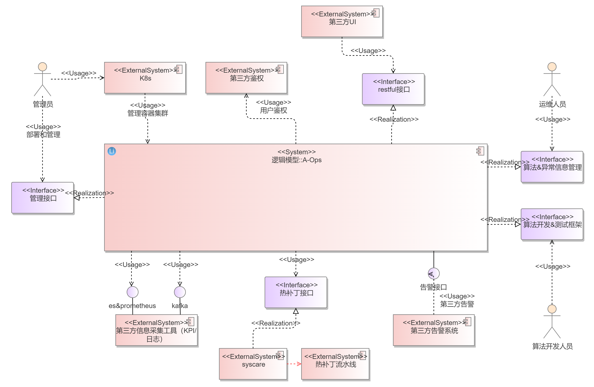
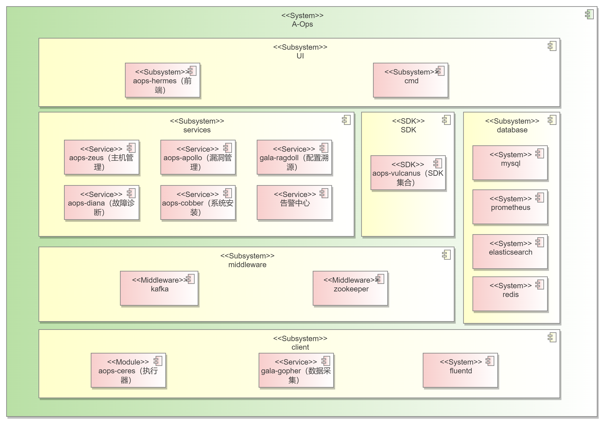
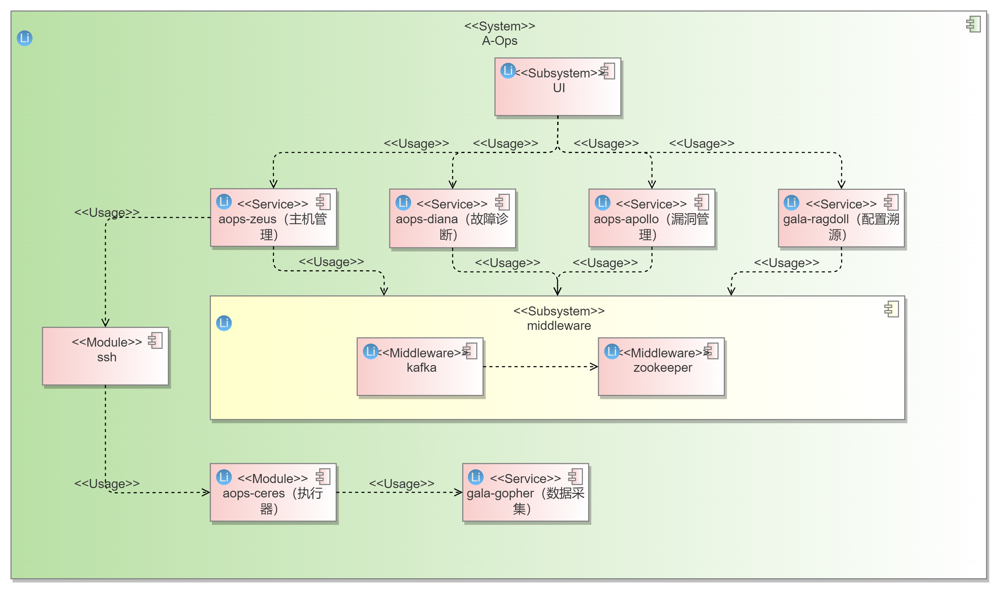
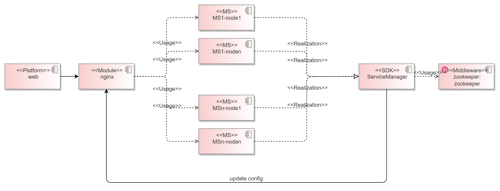
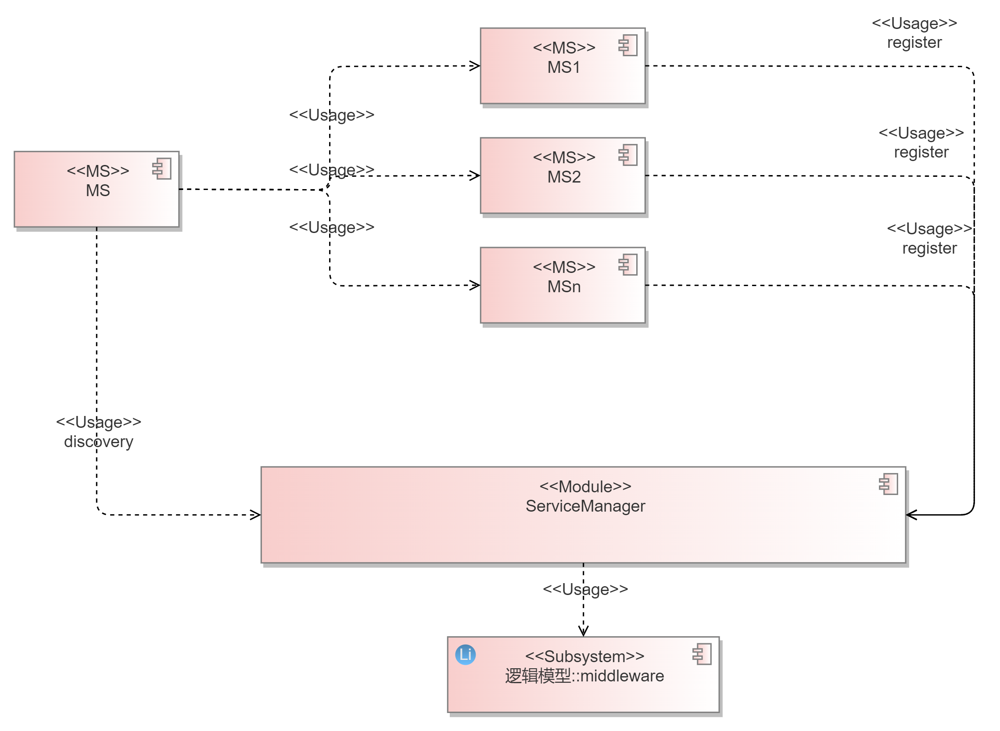
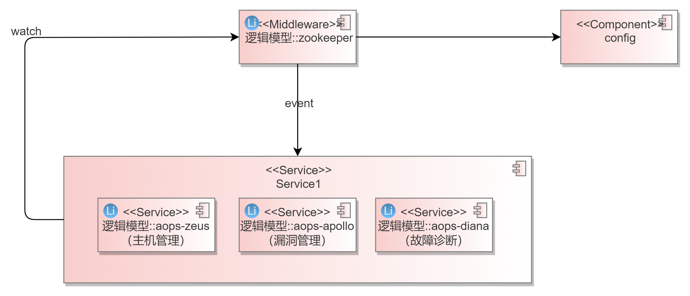
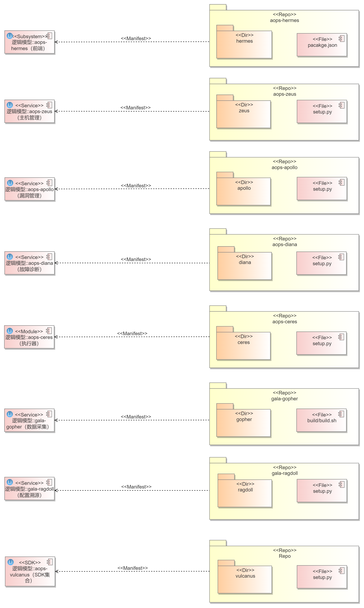
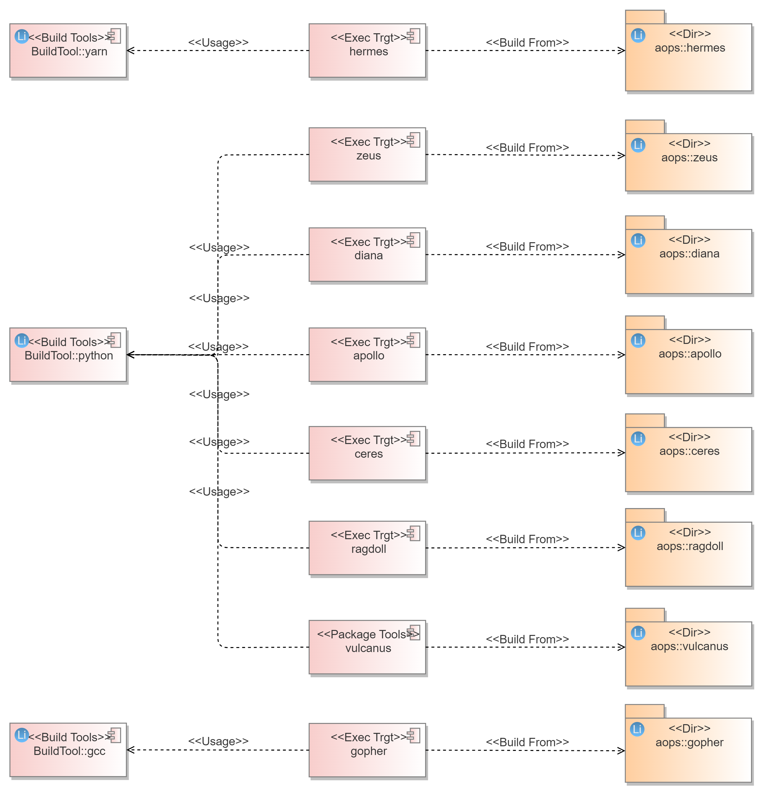

# 1、需求描述
​	Gartner通过对市场的分析：企业要求降低运维成本，另一方面运营复杂度却越来越高。运营的复杂性可以从体积、种类和速度三个维度上定义：IT基础设施和应用产生的数据量快速增长（每年增长2 ~3倍）；机器和人类产生的数据类型种类越来越多，指标、日志、线路数据和文档等。Gartner预计在未来五年，通过应用大数据和机器学习技术来分析服务的有效性，实现跨域分析可视，从而提高事件和问题参与度的AIOps。
​	从公有云和FusionServer统计的问题分布看，配置错误问题占比50%以上，居高不下。需要维护工具对配置错误快速排障。随着海量应用大量从x86平台向鲲鹏平台迁移，势必会出现各种各样的兼容性问题，性能问题，稳定性问题。对于鲲鹏水平解决方案，如大数据，分布式存储，数据库，HPC等方案，更需要能够可靠的部署在鲲鹏平台上。一旦出现问题，需要尽可能快速的对故障进行定界定位。
​	智能运维工具从如上问题出发，第一期预计实现智能运维基本框架，提供配置溯源，架构感知，故障定位基础能力，支持快速排障和运维成本降低。

## 1.1、受益人
| 角色     | 角色描述                                               |
| :------- | :----------------------------------------------------- |
| 运维人员 | 负责机器运维管理的人员                                 |
| 普通用户 | 个体用户，注册服务后，依赖于该系统对自己的机器进行监控 |

## 1.2、License

Mulan V2

# 2、架构目标
## 2.1、架构目标
1、各服务间解耦，通过restful或rpc方式进行通信，并能快速扩展服务；

2、通过增加服务实例提升系统性能，支持动态伸缩；

3、对部署节点上的资源占用有限制；

4、服务有保活机制；

## 2.2、假设和约束
1、整个系统首先保证能在openEuler22.03版本上运行，kernel版本为5.10。

2、系统相关的一些三方库以及开源软件也均在openEuler社区适配提供。

3、暂不考虑适配其他OS

4、开源使用

## 2.3、架构原则
| 原则                   | 原则描述                                                     |
| :--------------------- | :----------------------------------------------------------- |
| 单向依赖原则           | 不同层级之间的模块，仅允许上层调用下层                       |
| 全面解耦原则           | 对业务进行抽象建模，业务数据与业务逻辑解耦，系统各部件间解耦 |
| 服务化/组件化原则      | 以服务、数据为中心，构建服务化、组件化架构，具备灵活、按需组合的能力 |
| 接口隔离及服务自治原则 | 通过接口隐藏服务/组件的实现细节，服务/组件间只能通过接口进行交互，接口契约化、标准化，跨版本兼容；服务、组件可独立发展、独立发布、独立升级；服务自治，可视、可管、可控、可测、可维、故障自愈。 |
| 弹性伸缩原则           | 每个服务具备横向扩展能力，支持按需使用、自动弹性伸缩，可动态替换、灵活部署，支撑高性能、高吞吐量、高并发、高可用业务场景。 |
| 安全可靠原则           | 安全优先，在安全的前提下，可以允许通过手动关闭安全配置或策略来提升产品体验 |
| 持续演进原则           | 架构并非一蹴而就，需要有效地管理架构需求，持续构建和发展架构，适应业务需求变化，适时引入业界最佳实践，及时重构，确保架构生命力和竞争力 |

# 3、用例视图 

## 3.1、上下文模型
_关注系统边界，定系统与外部环境的交互，定义系统的范围，职责和边界_
### 3.1.1、 上下文视图

### 3.1.2、 外部接口描述
| 接口编号    | 类型            | 接口描述       | 规格 |
| :---------- | :-------------- | :------------- | :--- |
| restful接口 | _消息/接口调用_ | 各功能应用接口 |      |
| 管理接口    |                 |                |      |
| 热补丁接口  |                 |                |      |

## 3.2、 关键用例模型
### 3.2.1、关键用例
### 3.2.2、交互场景
_内部实现为黑盒，识别外部功能_
_包括主要业务流图，动态视角识别功能点_

# 4、逻辑视图
## 4.1、逻辑模型
### 4.1.1、0层逻辑模型

系统按照业务层次分为UI层、服务层、SDK、数据库层、client层

- UI层

  A-Ops对外提供restful api接口，可结合配套的web使用，其提供了web操作界面，同样也可以基于resetful接口实现命令行接口。

- 服务层

  服务层主要为A-Ops提供的一些核心能力，包括基础管理服务、异常检测服务、配置溯源服务、漏洞管理服务，其中：

  - 基础管理服务（zeus）负责主机节点的管理、用户信息的管理、节点插件的管理、主机监测指标的展示等，作为A-Ops的基础服务，为其他服务提供了主机查询、命令转发等接口。
  - 异常检测服务（diana）提供对机器的诊断能力，通过用户配置的工作流进行定时的故障诊断，检测到异常并诊断后发送告警告知运维人员。同时也支持对算法的导入和训练，方便运维人员快速创建适合自己业务场景的诊断工作流。
  - 配置溯源服务（ragdoll）提供对机器的配置管理能力，能够及时感知节点的配置变化，并产生告警信息；同样能够同步配置到节点，完成配置的统一下发。
  - 漏洞管理服务（apollo）提供了cve巡检&修复功能，并且支持热补丁修复。该服务能够定时扫描纳管主机的cve信息，并及时呈现给用户，用户可以在web界面上进行这些cve的处理。用户能够及时修复影响较大的cve，可选择冷热补丁两种方式。
  
- SDK

  A-Ops提供了一套统一的sdk库，该库封装了一些常用的基本功能，例如数据库连接、日志管理、异常处理、状态码定义、多线程、定时任务管理、服务管理等等

- 数据库层

  数据库层主要为A-Ops所依赖的数据库，为elasticsearch、mysql、redis、prometheus

  - elasticsearch作为分布式搜索引擎，其能够存储非结构化数据，包括配置信息及采集的日志数据，并提供高效的查询接口。
  - mysql作为关系型数据库，主要存储主机相关的信息、用户信息、告警信息等等。
  - redis作为支持key-value等多种数据结构的存储系统，在这里主要用作token存储、应用缓存加速，同时也可以支持服务中心。
  - prometheus作为时序数据库，主要存储client端采集的KPI数据

- client层

  client层主要为主机上运行的程序、服务等。
  
  - 执行器（ceres）作为一个执行框架，主要提供一些命令行接口，封装了若干命令，通过SSH通道能够支撑服务端的服务调用，例如主机注册、cve修复、插件管理等。该执行器作为执行框架屏蔽了底层的若干插件，并具备良好的扩展性。
  - 数据采集服务（gopher）为一套数据采集框架，其基于ebpf开发，能够提供多种低负载的探针，支持用户自定义配置，满足prometheus的接口规范。

### 4.1.2、1层逻辑模型

该逻辑模型主要体现了当前服务间的关系，几个服务间会存在一定的交互，并且服务一方面会继续往下拆解成更细的微服务，另一方面会不断地横向扩展，这样带来了配置的复杂性以及服务耦合性，因此提供了一个服务中心，每个上线的服务会先注册到服务中心，服务间的访问会首先通过服务中心来获取到其他服务的地址，随后访问。

服务端与客户端主要通过ssh通道来交互，专门提供了一个命令转发服务，通过ssh通道调用ceres提供的多种命令接口，同时ceres作为一个插件管理框架，也支持对多个服务进行管理，例如数据采集服务。

## 4.2、 技术模型
### 4.2.1、架构模式

1、整个系统涉及到前端及后端，采用前后端分离的模式，后端提供标准的restful接口供web或者命令行调用。

2、后端架构遵循微服务的设计模式，各个服务对外提供标准的restful接口，每个服务也会继续往下拆解出各个独立的微服务，具备单一的功能，供上层服务组合使用。

3、微服务开发能够使得各服务间尽量减少耦合，各个微服务能够独立开发，但是这样会使得服务数量增多，带来了管理及配置上的复杂性，因此引用了服务管理中心，支持对各服务进行动态管理。

### 4.2.2、技术选型

| 组件          | 具体选型        | 说明                                                         | 可获得性      |
| -------------------- | --------------- | ------------------------------------------------------------ | ------------- |
| 编程语言      | python、c/c++等 | 后端服务对于性能的要求并不高，因此选用易于开发的python作为主要语言，也支持使用java、go等主流语言开发微服务； 对于数据采集这种长期运行在客户端的服务，其性能有一定的要求，因此选用c/c++进行开发 | openEuler社区 |
| 服务开发框架  | flask           | Flask是一个轻量级的可定制框架，使用Python语言编写，较其他同类型框架更为灵活、轻便、安全且容易上手。 它可以很好地结合MVC模式进行开发，开发人员分工合作，小型团队在短时间内就可以完成功能丰富的中小型网站或Web服务的实现。 | openEuler社区 |
| 分布式服务    | zookeeper       |                                                              | openEuler社区 |
| 网关/负载均衡 | nginx           |                                                              | openEuler社区 |
| 消息队列      | kafka           |                                                              | openEuler社区 |
| 日志数据库    | elasticsearch   |                                                              | 官方社区      |
| 时序数据库    | prometheus      |                                                              | openEuler社区 |
| 关系型数据库  | mysql           |                                                              | openEuler社区 |

### 4.2.3、关键技术方案

#### 4.2.3.1、服务框架

nginx作为API网关以及负载均衡的关键组件，接收web端的请求，能够转发到不同的服务端口，并且能够做到负载均衡

#### 4.2.3.2、服务管理

系统使用独立的、中心化的服务注册中心，服务的调用在各服务侧，实现点对点地调用。

所有服务启动后定时同步服务状态，注册中心拥有最新的全量路由表，各服务定时拉取（也可以是注册中心事件触发并推送的方式）与自己有关的路由表，这样在服务调用时就优先在本地寻址并实现本地化的负载策略，进而直接与对应的服务通信。

在服务调用时我们需要有负载均衡的策略以决定在多实例情况下调用哪一个实例，常见的策略有：

- 随机：随机选择一个服务实例
- 轮询：将所有服务实例组成一个环，每次都调用上次调用节点的下一节点
- 加权：根据不同的加权项组合，比如：
  - 响应时间权重：每次请求后都会统计对应实例的响应时间，下次请求时优先分配响应时间快的实例
  - 区域权重：服务会跨机架、机房甚至国家与地区，这一策略会优先分配请求给相近节点的实例

#### 4.2.3.3、配置管理

# 5、开发视图

## 5.1、代码模型

A-Ops的每个服务均有个相应的代码仓，每个服务均可独立进行开发。

代码元素清单：

| 代码仓链接                                | 逻辑元素      |
| ----------------------------------------- | ------------- |
| https://gitee.com/openeuler/aops-hermes   | aops-hermes   |
| https://gitee.com/openeuler/aops-zeus     | aops-zeus     |
| https://gitee.com/openeuler/aops-ceres    | aops-ceres    |
| https://gitee.com/openeuler/aops-diana    | aops-diana    |
| https://gitee.com/openeuler/aops-apollo   | aops-apollo   |
| https://gitee.com/openeuler/aops-vulcanus | aops-vulcanus |
| https://gitee.com/openeuler/gala-gopher   | gala-gopher   |
| https://gitee.com/openeuler/gala-ragdoll  | gala-ragdoll  |

## 5.2、构建模型

openEuler以rpm作为软件的管理，因此最终会构建生成例如aops-hermes-v1.0.rpm的rpm包，并且一个服务可构建出多个子包，每个服务有相应的spec文件指导rpm包的构建生成。

- web服务涉及到相关的nodejs组件，主要通过yarn进行编译

- python相关的服务主要通过setup.py进行编译安装，项目本身开源，因此不做额外处理

- c相关的服务通过gcc编译成二进制后进行安装

构建元素清单

| 构建元素      | 构建过程   | 对应的代码元素                            |
| ------------- | ---------- | ----------------------------------------- |
| aops-hermes   | yarn build | https://gitee.com/openeuler/aops-hermes   |
| aops-zeus     | python     | https://gitee.com/openeuler/aops-zeus     |
| aops-ceres    | python     | https://gitee.com/openeuler/aops-ceres    |
| aops-diana    | python     | https://gitee.com/openeuler/aops-diana    |
| aops-apollo   | python     | https://gitee.com/openeuler/aops-apollo   |
| aops-vulcanus | python     | https://gitee.com/openeuler/aops-vulcanus |
| gala-gopher   | gcc        | https://gitee.com/openeuler/gala-gopher   |
| gala-ragdoll  | python     | https://gitee.com/openeuler/gala-rangdoll |

# 6、部署视图
##  6.1、部署模型

系统可采用k8s进行多节点部署，每个服务均可以按需增加多个实例，增加实例只需新增一个pod节点即可。数据库也通过k8s进行部署，可以选择多节点和单节点。若不采用k8s，也可通过部署脚本进行部署启动。

aops-ceres和gala-gopher可手动部署到主机，也可通过ansible进行批量部署。

# 7、 运行视图
## 7.1、运行模型

# 8、质量属性设计
## 8.1、性能设计

### 8.1.1、性能规格

| 规格名称     | 规格指标                                                     |
| :----------- | :----------------------------------------------------------- |
| 内存占用     | 服务端上对内存无限制，客户端平均占用低于10M，峰值占用低于100M |
| cpu占用      | 客户端平均占用低于3%                                         |
| 启动时间     | 单服务1s内启动                                               |
| 响应时间     | 1s内给出响应                                                 |
| 管理主机规格 | 单节点（4u 8g）部署支持对1000+台主机的监控                   |

## 8.2、可靠性设计

| 场景     | 设计说明                                                     |
| -------- | ------------------------------------------------------------ |
| 异常情况 | 可通过服务中心监控服务状态，定期进行健康状态检查，通过部署多实例可避免单个实例异常造成系统服务异常。 |
| 数据库   | 系统增加定时任务，在指定的时间段内，对系统中的数据做备份，默认保留最近1周的数据，便于后期恢复，该周期可配置 。 |
| 系统保活 | 每个服务通过systemd进行监控保活。                            |
| 异常捕获 | 代码实现时尽可能考虑异常场景，并及时捕获。                   |

## 8.3、安全性设计

| 场景            | 设计说明                                                     |
| --------------- | ------------------------------------------------------------ |
| 数据库权限      | 由于A-Ops支持多用户对其私人的主机/主机组进行检测和诊断，需要对不同用户的信息做隔离操作。数据库统一对用户进行了区分，即用户只能访问其相关主机的信息。 |
| 用户权限        | 对用户不作区分，均视为管理员，不同用户之间无法进行交互，目前系统有默认的admin账户，密码为changeme，用户登录后获取到token，后续通过token进行相应权限识别。 |
| 文件权限        | 采用权限最小化策略，各文件通用权限限定为644，个别文件视情况而定。 |
| restful接口安全 | 权限认证采用oAuth2.0协议，登录时获取token，发送请求时使用token进行身份验证，使用https服务确保请求参数被加密，后端接收请求后对接口参数做参数合法性校验。 |
| 命令注入        | 命令行操作，入参会做校验，而且后台为解析参数后调用restful接口，不存在入参拼接命令执行操作，所以不存在命令注入问题。 |
| 客户端权限      | 客户端执行部分命令需要获取root权限，在注册主机时会要求输入账号密码建立ssh公私钥对，后续通过ssh通道来下发命令，并且仅支持内置的命令，不支持用户自定义命令执行。 |

## 8.4、兼容性设计

| 场景     | 设计说明                                                     |
| -------- | ------------------------------------------------------------ |
| 接口兼容 | 1、服务对外接口使用restful接口，对外接口只能增量变化，新版本保证旧版本接口可用。 |
| 数据库   | 1、对于底层缓存，数据库的变更，对外不体现，由代码逻辑保证可用性。 2、涉及数据库表等重构时，提供迁移脚本。 |
| 版本     | 系统服务目前仅支持openEuler22.03以及openEuler20.03-LTS-SP3版本，配套版本发布。 |

## 8.5、可测试性设计

| 场景    | 设计说明                                                     |
| ------- | ------------------------------------------------------------ |
| ui      | 提供UI界面，可通过UI操作直接进行功能测试                     |
| service | 1、每个服务提供完整的restful接口文档，遵循swagger格式，因此可用postman等工具直接进行接口级的测试。 2、系统制定了统一的状态码标准，详见参考文档。 |
| unit    | 同步提供单元测试用例，覆盖接口、关键业务逻辑，覆盖率要求80%。 |

# 9、修改日志
| 版本 | 发布说明 |修改人|修改时间|
| :---- | :------- | :---| ----|
| 1.0.0 | 完成aops整体架构设计文档初稿，各个服务的详设见各自的特性设计文档 | 罗盛炜 | 2022/9/30 |
| 1.1.0 | 1、补充技术模型章节 2、补充DFX设计说明 3、修正逻辑模型元素，能够对应上当前的所有服务 |罗盛炜|2024/1/21|

# 10、参考目录