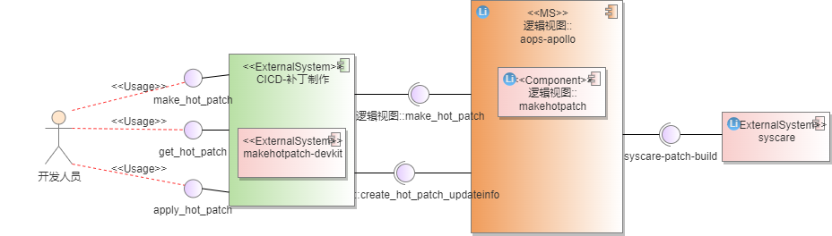
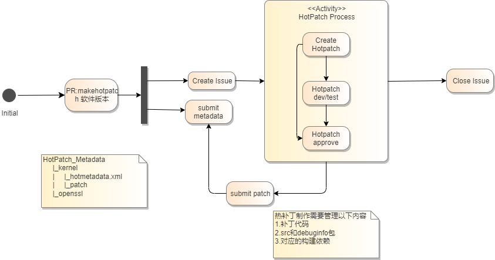
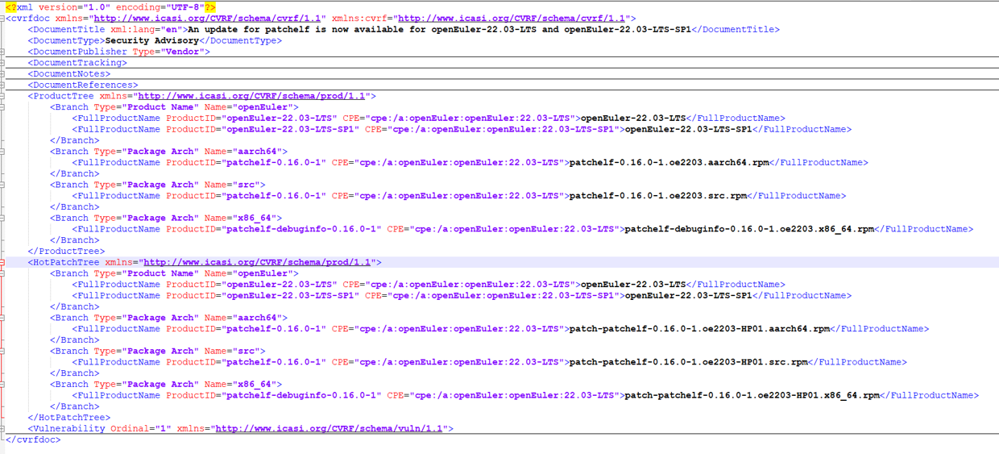
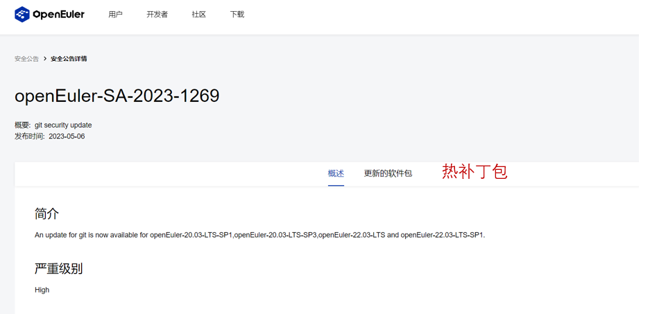
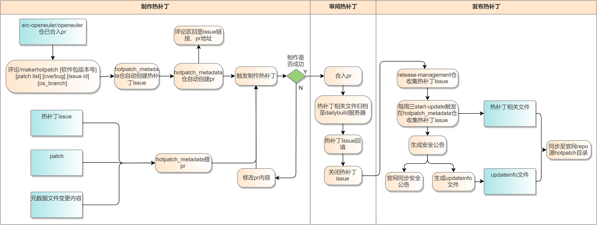
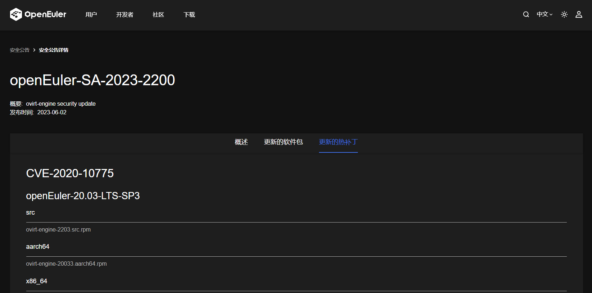

# 1、特性描述
操作系统作作为所有软件的基座，代码量巨大，社区会及时修复每一个发现的安全漏洞和缺陷，如果不及时修复这些问题，可能会带来系统安全隐患和宕机的风险。当前社区存在如下问题：  
1. 无热修复发布，仅支持热修复（内核/用户态热补丁）工具，但是需要用户自己制作，使用复杂

# 2、需求场景分析
## 2.1、CICD热补丁流水线需求场景分析
版本功能诉求：通过PR制作补丁；提供基础功能验证；提供开发人员离线调试；支持补丁发布到repo
- 开发者：根据补丁文件完成补丁制作，从个人制作和版本角度，提供便捷的制作工具和流水线；
  - 个人功能诉求：热补丁制作；
  - 版本功能诉求：通过PR制作补丁；提供基础功能验证；提供开发人员离线调试；支持补丁发布到repo
- 使用者：重点指个人使用者，提供获取社区热补丁发布件途径
  - 功能诉求：远程热补丁repo

**需求如下**

  - [IR-apollo-hotmake]支持冷热补丁制作和发布
  - [IR-apollo-hotmake-CICD]CICD流水线支持热补丁

通过以上业务流程分析，逻辑上分为：
CICD流水线配合，实现PR到补丁发布

### 2.1.1、支持CVE和Bugfix热补丁制作及信息发布

**包含IR清单**

| IR描述                                             |
| :------------------------------------------------- |
| [IR-apollo-hotmake]支持冷热补丁制作和发布          |
| [IR-apollo-hotmake-CICD]CICD流水线支持热补丁       |
| [IR-apollo-hotservice]apollo-service补丁服务       |
| [IR-apollo-hotmakeinfo]apollo-支持制作热补丁元数据 |



- 热修复除了热补丁限制外，还需要解决热补丁制作问题，通过在CICD中集成热补丁流水线，实现依赖PR完成热补丁制作。除了热补丁交付件本身外，还在updateinfo.xml内嵌入热补丁信息，管理热补丁到CVE和bugfix的关系。本章节主要介绍信息管理，详细热补丁流程参考2.1.1
- 客户手动获取补丁信息容易导致遗漏或者延期：上线补丁服务，支持补丁信息订阅和本地检测
- 为了实现热补丁发布，除了热补丁制作，还需要解决repo元数据的问题：apollo发布件新增热补丁制作工具集，主要包含1.热补丁制作管理，管理热补丁制作环境和提供对外接口；2.提供updateinfo.xml生成工具，根据传入的热补丁名称，PR描述（CVE和Bugfix信息）等，生成具备热补丁信息描述的updateinfo.xml（增量）
  

**补丁制作需求如下**

重点考虑增量补丁制作场景（补丁上打补丁），通过补丁制作项目功能实现管理

热补丁元数据通过扩展updateinfo.xml的方式，扩展出热补丁字段，提供工具支持

- [IR-apollo-hotmake]\[SR-hotmake-001\]支持管理热补丁制作项目
- [IR-apollo-hotmake]\[SR-hotmake-002\]支持热补丁制作（首次）
    - 需要传入补丁文件，源码，debuginfo等完整信息

- [IR-apollo-hotmake]\[SR-hotmake-003\]支持通过热补丁项目制作热补丁
    - 查询已有热补丁制作项目，在增量补丁制作情况，仅需要传入补丁文件

- [IR-apollo-hotmakeinfo]\[SR-hotmakeinfo-001\]创建热补丁updateinfo.xml
    - 通过给定软件包，cve等信息根据下面模板，生成包含热补丁信息的updateinfo.xml
    - 支持指定路径存储updateinfo.xml
- [IR-apollo-hotmakeinfo]\[SR-hotmakeinfo-002\]支持指定缺陷类型/ID/描述/严重等级/缺陷id等
    - 必选项：update-type，title，id，description，severity
    - 可选项：issued-date，update-status（默认stable）,issue链接地址，references-title（为空和title保持一致），reference-type（与update-type自动对应）
    - 其他信息根据热补丁包自动填充
    - 全局配置：update-from，release
- [IR-apollo-hotmakeinfo]\[SR-hotmakeinfo-004\]支持updateinfo与正式补丁包的正确性检测
    - 传入updateinfo.xml和热补丁包路径，检测热补丁是否真实存在，比较文件名和xml中描述是否一致


**CICD需求**



以PR为起点，支持通过PR下面回复命令的方式实现热补丁制作，并管理这些热补丁交付，在最终发布从这些热补丁中发布

1. 通过makerhotpatch <软件版本>，创建对应的issue跟踪热补丁发布流程

2. 同时根据<软件版本>从release目录中获取对应的源码包和debuginfo，在HotPatch仓库中创建对应的[元数据](# 热补丁元数据格式如下：)

3. 对应仓库地址通过issue反馈给开发人员，同时给出热补丁开发指导

4. 开发人员提交热补丁到仓库

   **//后续提需求给ebs，从ebs出接口支持热补丁制作**

- [IR-apollo-hotmake-CICD]\[SR-hotmake-CICD-001\]支持PR评论命令makehotpatch
    - PR合入后自动创建特定格式的热补丁issue
    - 获取src和debuginfo链接，提交到Hotpatch_matedata
    - 准备热补丁制作环境，完善issue信息，反馈给补丁制作和帮助文档给开发人员
    - 提供制作环境下载功能和指导文档，供开发人员自验证
    - 提交补丁到matedata
- [IR-apollo-hotmake-CICD]\[SR-hotmake-CICD-002\]创建热补丁元数据[updateinfo.xml](# **updateinfo.xml参考格式如下**)
    - 热补丁制作成功后，自动创建updateinfo.xml。并与热补丁存储在统一路径

- [IR-apollo-hotmake-CICD]\[SR-hotmake-CICD-003\]热补丁评审发布
    - 收集未发布热补丁issue
    - 根据所选择的issue收集热补丁交付件
    - 根据热补丁清单，更新updateinfo并推送热补丁到repo

**热补丁服务**

- [IR-apollo-hotservice]\[SR-hotservice-001\]支持补丁信息订阅
  - 有新的补丁发布时，支持以邮件和短信的方式发送补丁信息。补丁信息包括CVE/BUG描述，CVE id，涉及软件包列表，是否支持热补丁修复等
- [IR-apollo-hotservice]\[SR-hotservice-002\]安全公告支持热补丁信息显示
  - [cvrf.xml](# cvrf.xml参考格式如下)参考ProductTree新增HotPatchTree字段，存储热补丁信息，方便前台显示
  - 如果存在热补丁，对应安全公告新增热补丁页签

- [IR-apollo-hotservice]\[SR-hotservice-003\]新增热补丁中心展示页面

###### **updateinfo.xml参考格式如下**

```xml
<?xml version="1.0" encoding="UTF-8"?>  
<updates>  
     <update from="openeuler.org" type="security/bugfix/feature" status="stable">  
          <id>openEuler-SA-2021-1502</id>  
          <title>An update for polkit is now available for openEuler-20.03-LTS-SP3</title>  
          <severity>Important</severity>  
          <release>openEuler</release>  
          <issued date="2022-01-27"></issued>  
          <references>  
               <reference href="https://nvd.nist.gov/vuln/detail/CVE-2021-4034" id="CVE-2021-4034" title="CVE-2021-4034" type="cve"></reference>  
          </references>
          <description>xxxxxxxxxxxxx</description>
          <pkglist>
               <collection>
                    <name>openEuler</name>
                    <package arch="aarch64/noarch/x86_64" name="polkit" release="9.oe1" version="0.116">
                         <filename>polkit-0.116-9.oe1.aarch64.rpm</filename>
                    </package>
               </collection>
			   //本次新增字段
			   <hot_patch_collection>
                    <name>openEuler</name>
                    <package arch="aarch64" name="polkit" release="9.oe1" version="0.116">
                         <filename>polkit-0.116-9.oe1.aarch64.rpm</filename>
                    </package>
                    <package arch="noarch" name="polkit-help" release="9.oe1" version="0.116">
                         <filename>polkit-help-0.116-9.oe1.noarch.rpm</filename>
                    </package>
			   </hot_patch_collection>
          </pkglist>
     </update>
</updates>
```


###### **cvrf.xml参考格式如下**



###### **安全公告修改示意图如下**



###### **热补丁元数据格式如下：**

```
<?xml version="1.0" encoding="UTF-8"?>
<hotpatchdoc xmlns="https://gitee.com/openeuler/hotpatch_data" xmlns:cvrf="https://gitee.com/openeuler/hotpatch_data">
	<DocumentTitle xml:lang="en">Managing Hot Patch Metadata</DocumentTitle>
	<HotPatchList>
	<Package Name="kernel-xxxxxxx" Type="cve/bug" statue="i/f/s">
	    <hotpatch version="1">
	        <SRC_RPM>download_link</SRC_RPM>
		    <Debug_RPM>download_link</Debug_RPM>
		</hotpatch>
        <hotpatch version="2">
	        <SRC_RPM>download_link</SRC_RPM>
		    <Debug_RPM>download_link</Debug_RPM>
		</hotpatch>
	</Package>
	</HotPatchList>

</hotpatchdoc>
```

## 2.2、Story分解
### 2.2.1、22.03-LTS-SP2 版本需求分解
| CICD流水线支持热补丁 | 支持PR评论命令makehotpatch     | 社区CICD流程支持 | 说明 |
| -------------------- | ------------------------------ | ---------------- | ---- |
|                      | 安全公告包含热补丁信息         | 社区CICD流程支持 |      |
|                      | 创建热补丁元数据updateinfo.xml | 社区CICD流程支持 |      |
|                      | 热补丁评审发布                 | 社区CICD流程支持 |      |

## 3.1、CICD热补丁流水线

CICD热补丁流水线流程：



### 3.1.1、热补丁制作

#### 3.1.1.1、源码门禁工程

##### 3.1.1.1.1、创建门禁工程

> 在支持热补丁制作的代码仓下单独创建工程，用来在pr下触发工程。

src-openEuler/openEuler下的pr由用户评论makehotpatch后，触发热补丁制作以及热补丁issue生成，将生成的issue链接以及ci运行提示和结果评论在该pr下方。

```shell
/makerhotpatch <软件版本> <补丁名> <补丁type> <cve_issue id> <os_branch>
```

##### 3.1.1.1.2、门禁工程流程

**创建issue**

- 创建特定格式的热补丁issue，热补丁issue提在hotpatch_metadata仓库

  标题：[HOTPATCH]/[软件-版本号]fix  issue_id

  类型选择：hotpatch

  描述：  	

  ```
  问题类别：cve/bugfix （从cve issue中获取）
  热补丁元数据：https://gitee.com/wanghuan158/hot-patch_metadata/blob/master/openEuler-22.03-LTS-SP1/openssl/1.1.1m-20/hotmetadata.xml
  
  热补丁路径：需要在热补丁制作成功后回填
  ```

- 创建完成后在源码仓pr中返回issue链接

**submit metadata**

- 获取包链接：根据<软件版本>从release目录中获取对应的源码包和debuginfo链接，在HotPatch_metadata仓库中创建或更新对应的元数据，debuginfo区分架构

- 生成hotmetadata.xml：

  git clone HotPatch_metadata仓库，根据软件包、版本信息查找是否有hotmetadata.xml

  无hotmetadata.xml：创建hotmetadata.xml

  有hotmetadata.xml：拿到最新的版本号，添加hotpatch，version+1，获取上次生成的src包

- 获取patch包：根据本次pr提交信息拿到patch文件

- 提交pr：提交pr (patch文件、hotmetadata.xml) 到HotPatch_metadata仓库

- 结果返回：源码仓pr中返回HotPatch_metadata仓库pr链接

元数据格式：

```xml
<?xml version="1.0" ?>
<ns0:hotpatchdoc xmlns:ns0="https://gitee.com/openeuler/HotPatch_metadata">
	<DocumentTitle xml:lang="en">Managing Hot Patch Metadata</DocumentTitle>
	<HotPatchList>
		<Package name="openssl-1.1.1m-20">
			<hotpatch version="1" type="cve">
				<SRC_RPM>download_link</SRC_RPM>
				<Debug_RPM_X86_64>download_link</Debug_RPM_X86_64>
				<Debug_RPM_Aarch64>download_link</Debug_RPM_Aarch64>
				<patch>0001-PEM-read-bio-ret-failure.patch</patch>
				<issue id="CVE-2023-33203" hotpatch_issue_href="https://gitee.com/src-openeuler/kernel/issues/I75ZRL"/>
				<hotpatch_issue_link>https://gitee.com/wanghuan158/hot-patch_metadata/issues/I7AE5F</hotpatch_issue_link>
			</hotpatch>
			<hotpatch version="2" type="cve">
				<SRC_RPM>download_link</SRC_RPM>
				<Debug_RPM_X86_64> download_link</Debug_RPM_X86_64>
				<Debug_RPM_Aarch64>download_link</Debug_RPM_Aarch64>
				<patch>0001-PEM-read-bio-ret-failure.patch</patch>
				<issue id="CVE-2023-33203" hotpatch_issue_href="https://gitee.com/src-openeuler/kernel/issues/I75ZRL"/>
				<hotpatch_issue_link>https://gitee.com/wanghuan158/hot-patch_metadata/issues/I7AE5P</hotpatch_issue_link>
			</hotpatch>
		</Package>
	</HotPatchList>
</ns0:hotpatchdoc>
```

> 注意：download_link均为repo仓正式的归档链接
>
> 热补丁当前只考虑演进，version 2 基于version 1的src继续构建

HotPatch_Metadata仓库目录格式：

```
HotPatch_Metadata
|22.03-LTS
|_kernel
|  |_4.19
|    |_hotmetadata.xml
|    |_patch1
|    |_patch2
|    |_patch3
|  |_5.10
|    |_hotmetadata.xml
|    |_patch1
|    |_patch2
|    |_patch3
|22.03-LTS-sp1
|_openssl
```

#### 3.1.1.2、热补丁制作工程

> 创建工程，用来在HotPatch_metadata仓库pr下触发制作热补丁工程
>
> 触发条件：提交pr、评论 /retest
>

##### 3.1.1.2.1、下载包

- 通过pr下载需要制作热补丁的src包、debuginfo包、patch包
- 通过hotmetadata.xml拿到本次编译的热补丁版本号

##### 3.1.1.2.2、解析获取依赖包

- 通过解压src.rpm包获取spec文件，解析获取依赖包

##### 3.1.1.2.3、syscare build编译

> syscare build不支持docker，只支持物理机/虚拟机
>
> 环境要求：配置repo源、环境隔离、环境复用

- 编译环境

只配置一个虚拟机，设置多个chroot（4个），从工程层面判断软件包使用哪个chroot，有4个chroot占满其它任务排队等待；

环境复用，同一个pr使用同一个chroot环境，根据issue判断，需要提供打包环境功能

- 编译命令：


门禁环境kjob为8，设置4个changeroot，入参--kjob 2

```shell
syscare build --patch-name {补丁包路径} --source {src包路径} --debuginfo {debuginfo包路径} --output hotpatch {patch文件}
```

- 返回编译结果至pr中

##### 3.1.1.2.4、创建热补丁信息文件

- 热补丁制作成功后，调用updateinfo文件生成工具，生成hotpatch.xml文件，用于展示热补丁信息

>  x86、aarch64、source包都需要生成hotpatch.xml文件，统一归档sysacre build编译后x86架构生成的source包

调用说明：

```shell
gen_updateinfo "security" 【门禁这边根据reference-type生成，{cve:security, bugfix:bugfix, feature:enhancement}】\
			   "fix 0001-PEM-read-bio-ret-failure.patch" 【热补丁issue的标题】\
			   CVE-2021-32675 【如果reference-type为cve，就是CVE-XXX-XXX的格式；要不直接用issue-id】\
			   --reference-type cve 【reference-type】\
			   --reference-id CVE-2021-32675 【如果reference-type为cve，就是CVE-XXX-XXX的格式；要不直接用issue-id】\
			   --reference-href "https://gitee.com/src-openeuler/kernel/issues/I75ZRL?from=project-issue" 【issue-id所对应的issue链接】\
			   --issued-date 2023-01-01 【热补丁Issue的创建时间】\
			   --package-dir ./hotpatch_pkg 【门禁生成的热补丁的目录】\
			   --output-path ./hotpatch.xml 【hotpatch.xml的生成路径】
						  
```

##### 3.1.1.2.5、热补丁相关文件归档

- 拷贝热补丁包、source、updateinfo.xml到文件服务器


- 热补丁结果拷贝到远程文件服务器


CI 文件服务器目录结构

```
| hotpatch
   |hot-patch_metadata
	 |pr_id
		|x86_64
			|Packages
				|patch-kernel-4.19-1-HP001-1-1.x86_64.rpm
			|hotpatch_xml
				|patch-kernel-4.19-1-HP001-1-1.x86_64.xml
		|aarch64
			|Packages
				|patch-kernel-4.19-1-HP001-1-1.x86_64.rpm
			|hotpatch_xml
				|patch-kernel-4.19-1-HP001-1-1.x86_64.xml
		|source
			|Packages
				|kernel-4.19-1-HP001-1-1.src.rpm
			|hotpatch_xml
				|kernel-4.19-1-HP001-1-1.src.xml
```

#### 3.1.1.3、手动触发热补丁制作

- 开发者阅读readme根据热补丁issue模版创建热补丁
- fork HotPatch_Metadata仓库，在对应的软件包和版本的文件夹下修改/新增patch、创建或更新对应的元数据，提交pr
- CICD重新触发制作热补丁

### 3.1.2、热补丁审阅

**同意pr合入**

> 触发热补丁相关文件归档、热补丁Issue信息回填

- 根据pr变更内容拿到本次pr的软件包、版本、热补丁名称等信息
- 删除提pr生成的临时分支
- 从远程服务器对应目录拷贝热补丁包、updateinfo.xml到门禁环境
- 拷贝热补丁包、updateinfo.xml到dailybuild服务器
- 远程登录dailybuild机器，执行命令：

```shell
createrepo --update -d ${pkg_path}/$arch
```

```
热补丁地址：http://121.36.84.172/hotpatch/{branch}/{arch}/Packages
```

- 热补丁路径、updateinfo.xml路径回填到issue中

dailybuild目录结构：

```
| 22.03-LTS-SP1
	|x86_64
		|packages
			|patch-kernel-4.19-1-HP001-1-1.x86_64.rpm
			|patch-kernel-4.19-1-HP002-1-1.x86_64.rpm
			|patch-redis-4.19-1-HP002-1-1.x86_64.rpm
		|repodata
			xxx
		|hotpatch_xml
			|patch-kernel-4.19-1-HP001-1-1.x86_64.xml
			|patch-kernel-4.19-1-HP002-1-1.x86_64.xml
			|patch-redis-4.19-1-HP002-1-1.x86_64.xml
	|source
		|packages
			|kernel-4.19-1-HP001-1-1.src.rpm
			|kernel-4.19-1-HP002-1-1.src.rpm
			|redis-4.19-1-HP002-1-1.src.rpm
		|repodata
			xxx
		|hotpatch_xml
			|patch-kernel-4.19-1-HP001-1-1.src.xml
			|patch-kernel-4.19-1-HP002-1-1.src.xml
			|patch-redis-4.19-1-HP002-1-1.src.xml
```


### 3.1.3、热补丁发布

#### 3.1.3.1、release-management仓收集issue

- 每周三触发start-update命令，补丁issue在指定的仓库以hotpatch标签查找，默认查找已经关闭的补丁issue

#### 3.1.3.2、生成安全公告热补丁信息

- 在生成安全公告的同时生成hotpatch字段补丁，过滤已经发布的漏洞
- 在安全公告文件新增HotPatchTree字段，记录和公告相关漏洞的热补丁，每个补丁按架构和CVE字段区分（Type=ProductName 记录分支，Type=ProductArch 记录补丁具体的rpm包）

#### 3.1.3.3、Majun平台上传文件到openEuler官网，同步生成updateinfo.xml文件

- 根据热补丁issue增量生成updateinfo.xml文件

updateinfo.xml文件格式：

```xml
        <?xml version="1.0" encoding="UTF-8"?>
        <updates>
            <update from="openeuler.org" type="security" status="stable">
                <id>openEuler-SA-2022-1</id>
                <title>An update for mariadb is now available for openEuler-22.03-LTS</title>
                <severity>Important</severity>
                <release>openEuler</release>
                <issued date="2022-04-16"></issued>
                <references>
                    <reference href="https://nvd.nist.gov/vuln/detail/CVE-2021-1111" id="CVE-2021-1111" title="CVE-2021-1111" type="cve"></reference>
                    <reference href="https://nvd.nist.gov/vuln/detail/CVE-2021-1112" id="CVE-2021-1112" title="CVE-2021-1112" type="cve"></reference>
                </references>
                <description>patch-redis-6.2.5-1-HP001.(CVE-2022-24048)</description>
                <pkglist>
                <hot_patch_collection>
                    <name>openEuler</name>
                    <package arch="aarch64" name="patch-redis-6.2.5-1-HP001" release="1" version="1" id="CVE-2021-1111" >
                        <filename>patch-redis-6.2.5-1-HP001-1-1.aarch64.rpm</filename>
                    </package>
                    <package arch="x86_64" name="patch-redis-6.2.5-1-HP001" release="1" version="1" id="CVE-2021-1111">
                        <filename>patch-redis-6.2.5-1-HP001-1-1.x86_64.rpm</filename>
                    </package>
                    <package arch="aarch64" name="patch-redis-6.2.5-1-HP002" release="1" version="1" id="CVE-2021-1111,CVE-2021-1112">
                        <filename>patch-redis-6.2.5-1-HP002-1-1.aarch64.rpm</filename>
                    </package>
                    <package arch="x86_64" name="patch-redis-6.2.5-1-HP002" release="1" version="1" id="CVE-2021-1111,CVE-2021-1112">
                        <filename>patch-redis-6.2.5-1-HP002-1-1.x86_64.rpm</filename>
                    </package>
                </hot_patch_collection>
                </pkglist>
            </update>
            ...
        </updates>
```

- openEuler官网展示热补丁信息

- 新增子标签页“更新的热补丁”，子标签页体现CVE和热补丁

子标签页结构：



#### 3.1.3.4、热补丁文件同步至repo源下update_hotpatch目录

- 拉取dailybuild相关热补丁文件
- obs上拉取updateinfo文件

# 4、修改日志

| 版本  | 发布说明                     | 修改人 | 修改时间  |
| :---- | :--------------------------- | ------ | --------- |
| 1.0.0 | 1.新增热补丁流水线           | 胡峰   | 2023/5/11 |
| 1.1.0 | 1.增加CICD热补丁门禁模块设计| 王光格 | 2023/6/16 |
