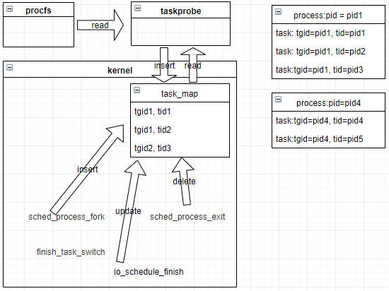
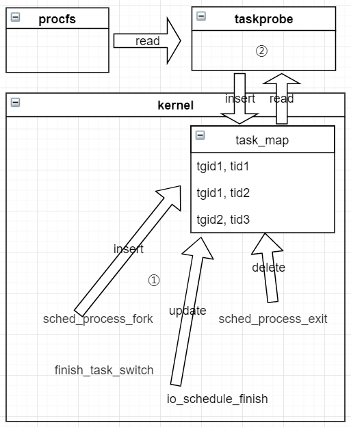

# 进程/线程监控方案

## 概念澄清

- 进程，线程

开发和运维过程中，经常遇到进程、线程，从操作系统的角度来看，没有区分进程和线程，都用内核对象task_struct管理，即task，这也是CPU调度的实体。 进程的PID和线程TID，都用task_struct::pid表示。

- 线程组

线程组是一组有关联的线程，就是用户角度看到的包含多个线程的进程，分主线程和其他线程，线程组的ID称为TGID，等于这个线程组中主线程的TID，使用task_struct::tgid表示。

## 功能说明

因此通过监控所有task_struct对象即可获取用户角度看到的进程、线程信息，只需在具体使用时对获取的所有task_struct对象按照需要聚合即可，如通过tgid筛选属于同一个进程的task。监控的的内容包括：

- 既包括内核态，也包括用户态；

- 生命周期（包括探针启动前已有的和启动后新创建的）；

- 指标信息（如CPU占用率、Mem占用率、网络流量、fd数量等)；

## 整体方案

### 生命周期管理方案

对于探针启动前已经存在的进程/线程，探针启动时通过遍历/proc一次性获取，探针启动后新创建的进程/线程通过在sched_process_fork函数挂载钩子函数在task_map中插入对象，所有的进程/线程在sched_process_exit函数挂载钩子函数从task_map中删除对象。探针的用户态程序周期性读取后输出到标准输出。插入对象时获取的task关键信息包括：

- tid：task id
- tgid：task group id
- comm：命令名

### 指标获取

#### 指标包括

- ​CPU资源相关
  - task_utime_jiffies：task用户运行时间
  - task_stime_jiffies：task系统态运行时间

- 内存资源相关
  - task_minor pagefault_count：task轻微pagefault次数（无需从磁盘拷贝）
  - task_major pagefault_count：task严重pagefault次数（需从磁盘拷贝）
  - task_vm_size：task当前虚拟地址空间大小
  - task_pm_size：task当前物理地址空间大小
  - task_page_cache_count：task触发的page cache操作次数
  - task_shared_dirty_size：task共享属性的dirty page size
  - task_shared_clean_size：task共享属性的clean page size
  - task_private_dirty_size：task私有属性的dirty page size
  - task_private_clean_size：task私有属性的clean page size
  - task_referenced_size：task当前已引用的page size
  - task_lazyfree_size：task延迟释放内存的size
  - task_swap_data_size：task swap区间数据size
  - task_swap_data_pss_size：task 物理内存swap区间数据size

- 网络资源相关
  由endpoint承载

- 磁盘资源相关：
  - task_io_wait_time_max	Gauge：IO操作等待最大时间
  - task_io_request_time_max：task request io操作最大时间
  - task_rchar_bytes：task读取字节数
  - task_wchar_bytes：task写入字节数
  - task_syscr_count：task read()/pread()执行次数
  - task_syscw_count：task write()/pwrite()执行次数
  - task_read_bytes：task实际从磁盘读取的字节数
  - task_write_bytes：task实际从磁盘写入的字节数

- 调度信息
  - task_switch_offcpu_time_max：task调度offcpu的最大时间
  - task_fork_count：task fork次数
  - task_signal_count：task 接收信号次数
  - task_migration_count：task CPU之间迁移次数
  - task_syscall_fails：task 系统调用失败次数
  - task_oom_count：task触发的oom次数
  - task_fd_count：task文件句柄
  - task_state：task状态

#### 获取方案

​目前方案待定，还在调研阶段。目标是获取实时的指标信息动态刷新，现有调研发现，/proc目录下的包括系统和进程级的信息，至少在cat查看的时候，是被迫更新的不是主动更新的。

### 过滤

​考虑到对系统资源占用，需要对监控对象进行过滤，只监控关键进程和关键线程。

#### 可能的过滤条件

- 1.知名应用
  - java应用服务器，如Tomcat、Jboss
  - 其他java应用程序，如Kafka
  - 数据库，如Oracle、MySQL/MariaDB、SQL Server、PostgreSQL、InfluxDB、Redis、MongoDB、CouchDB、Neo4j、Cassandra
  - Web server，如Apache HTTP、Nginx、Haproxy
- 2.内核关键线程
- 3.用户指定程序，要求用户指定某些程序名称
- 4.创建了连接，如udp、tcp
- 5.指标异常(固定阈值)，如对某种资源占用大幅增加

#### 过滤方案

- 内核态过滤

如图中①所示，在内核态数据收集的时候中按照过滤条件过滤；

- 对于过滤条件1、2、3，在sched_process_fork的钩子函数中通过白名单过滤，
- 对于过滤条件4在创建连接时增加
- 对于过滤条件5在指标异常时添加

优点：
在数据源头过滤，最大程度降低系统资源消耗；

缺点：

- 条件3需要将用户输入传递到内核bpf程序中；
- bpf程序每次执行需要进行白名单检查，如果白名单较长，大量字符串比较可能导致内核资源占用过多；

- 用户态过滤

如图中②所示，所有信息先采集，然后在用户态周期读取的时候进行将满足过滤条件的删除。

优点：

- 用户态周期性进行过滤，不增加内核资源占用；
- 条件5可以使用动态阈值；

缺点：
有些无用的进程可能在一段时间内占用了map，map空间需要分配大一点。
