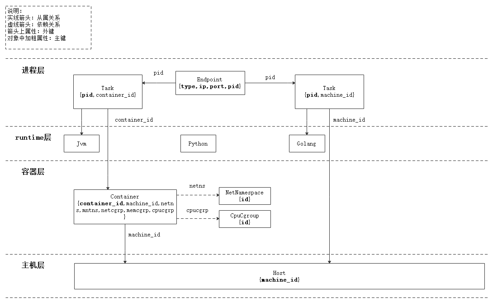

# gala-spider

## 介绍
gala-spider是用于架构感知拓扑绘制服务，该程序提供一个配置文件，支持拓扑算法可替换、DB源可替换、UI程序可替换以及metric信息可配置等，方便用户使用；

## 快速开始

### 基于源码编译、安装、运行

- 安装依赖

  依赖模块安装

  ```bash
  yum install -y configparser multiprocessing
  yum install -y python3-connexion
  yum install -y python3-kafka-python          	 # DB源采用kafka
  yum install -y python3-py2neo                    # UI程序采用neo4j
  ```

- 构建

  ```
  /usr/bin/python3 setup.py build
  ```

- 安装

  ```
  /usr/bin/python3 setup.py install
  ```

- 运行

  ```bash
  python3 -m spider
  ```

### 基于rpm包安装运行

- 安装

  ```
  yum install gala-spider-1.0.0.tar.gz
  ```

- 运行

  ```
  systemctl start gala-spider
  ```

## 总体介绍

gala-spider用于架构感知探测结果呈现，可以根据各个节点上报的观测数据，整合分析得到整个集群的拓扑关系以及拓扑指标信息。库上代码支持数据库是kafka、UI是neo4j的链路拓扑绘制服务；gala-spider有良好的扩展性，DB可支持prometheus、telemetry 等，UI层可替换，以及拓扑算法可替换，可以发挥社区的力量丰富展示能力；gala-spider中的几个部件：

- 实现源码

  主要包括db_agent、data_process和ui_agent目录，分别实现数据库数据初步处理、拓扑绘制算法处理和对接UI展示等功能；gala-spide支持DB、UI以及拓扑算法可替换，需要在config/gala-spider.conf中配置正确的db_agent和ui_agent，主程序会读取配置信息并拉起相关处理进程。

- 部署配置文件

  gala-spider运行配置文件，可自定义具体使用的DB（kafka/promecheus等）、UI（neo4j等）；当前拓扑绘制算法不支持自定义；

### 运行架构


### 3D 拓扑图分层架构



观测对象说明：
1. Host：主机/虚拟机节点
    - machine_id：主机ID，用于标识网络中的一台主机/虚拟机。
  
2. Container：容器节点
    - container_id：容器ID，用于标识主机/虚拟机上的容器。
    - machine_id：主机ID，用于关联容器所属的主机/虚拟机。
    - netns：容器所在的 net namespace 。
    - mntns：容器所在的 mount namespace 。
    - netcgrp：容器关联的 net cgroup 。
    - memcgrp：容器关联的 memory cgroup 。
    - cpucgrp：容器关联的 cpu cgroup 。
    
3. Task：进程节点
    - pid：进程ID，用于标识主机/虚拟机或容器上运行的一个进程。
    - machine_id：主机ID，用于关联进程所属的主机/虚拟机。
    - container_id：容器ID，用于关联进程所属的容器。
    - tgid：进程组ID。
    - pidns：进程所在的 pid namespace 。
    
4. Endpoint：进程的通信端点
    - type：端点类型，如 TCP 、UDP 等。
    - ip：端点绑定的 ip 地址，可选项。
    - port：端点绑定的端口号，可选项。
    - pid：进程ID，用于关联端点所属的进程ID。
    - netns：端点所在的 net namespace 。
    
5. Jvm：Java程序运行时
6. Python：Python程序运行时
7. Golang：Go程序运行时

8. AppInstance: 应用实例节点
    - pgid：进程组ID，用于标识一个应用实例。
    - machine_id：主机ID，用于关联应用实例所属的主机/虚拟机。
    - container_id：容器ID，用于关联应用实例所属的容器。
    - exe_file: 应用可执行文件，用于标识一个应用。
    - exec_file：应用被执行文件，用于标识一个应用。


### 接口文档

[Restful API](doc/swagger.yaml)

## 详细介绍

### 配置文件介绍

[配置文件介绍](doc/conf_introduction.md)

### 如何新增观测对象
[如何新增观测对象](doc/how_to_add_new_observe_object.md)

### 如何开发其他呈现服务

[开发指南](doc/development_guidelines.md)

